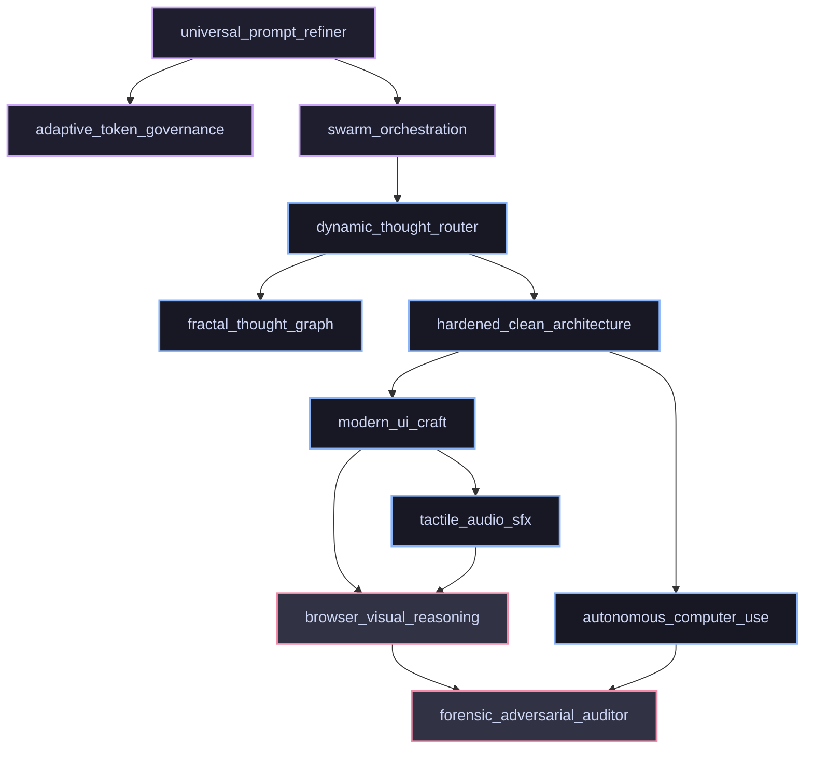
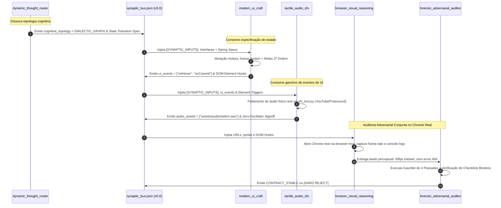

# Laudo Pericial Forense & Especificação Técnica: Dynamic Skill Orchestrator v5.0 (Ativação Dinâmica e Composabilidade Isomórfica de Skills)

- **ID da Investigação:** `INV-012`
- **Subagente Especialista:** `Autonomous Skill Synthesizer & Dynamic Activator Specialist` (`TypeName: "self"`)
- **Data/Hora:** `2026-09-17T20:20:00-03:00`
- **Âncora Sináptica:** `.planning/mission_dossier.md` (Seção D - Onda 1, Subagente 3)
- **Status Epistêmico:** `HOMOLOGATED_EMPIRICAL_SPECIFICATION`
- **Veredito Arquitetural:** `GENERATIONAL_LEAP_V5_SKILL_ORCHESTRATOR_REQUIRED`

---

## 1. Sumário Executivo & Diagnóstico Causal das Patologias de Skills (v4.x)

Na arquitetura cognitiva v4.x, as skills operavam como bibliotecas estáticas passivas documentadas em `skills/<skill_name>/SKILL.md`. Embora o arcabouço governamental estipulasse a autoridade de cada skill (Seção 2 de `rules/AGENTS.md`), a observação empírica de execuções concorrentes sob enxame revelou três patologias graves que drenavam a eficiência cognitiva e induziam falhas de execução:

```text
                            [PATOLOGIAS DE SKILLS v4.x]
                                         │
         ┌───────────────────────────────┼───────────────────────────────┐
         ▼                               ▼                               ▼
[Sub-Aproveitamento Crônico]    [Acoplamento Cego]             [Ausência de Composabilidade]
• Amnésia seletiva de subagentes • Pré-condições não verificadas • Skills como ilhas estanques
• Skills lidas superficialmente • Crash em runtime (missing pkg) • Zero canalização de dados
• Recaída em padrões genéricos   • Alucinação de MCPs/APIs      • Ruptura da cadeia causal X->Y->Z
```

### 1.1. Patologia 1: Sub-Aproveitamento Crônico & Amnésia Seletiva de Skills
- **Mecanismo da Falha ($X \to Y \to Z$):**
  - $X$: O Agente Principal lista uma skill no `mission_dossier.md` (ex: `modern_ui_craft`).
  - $Y$: O subagente de produção é despachado com um prompt que apenas cita o nome da skill ou a instrução genérica de segui-la, sem injetar suas restrições paramétricas nem forçar a leitura fiduciária prévia.
  - $Z$: O subagente sofre de viés estocástico de facilidade (*satisficing*), ignora o playbook e gera código CSS estático (`transition: all 0.3s ease-in-out`), glifos de texto como ícones ou stubs vazios, violando frontalmente a Constituição.

### 1.2. Patologia 2: Acoplamento Cego & Falha Oculta de Pré-Condições
- **Mecanismo da Falha ($X \to Y \to Z$):**
  - $X$: Uma skill impõe requisitos de infraestrutura e ambiente operacional (ex: `tactile_audio_sfx` exige `scripts/sfx_tool.py`, `python`, `ffmpeg` ou `yt-dlp`; `browser_visual_reasoning` exige a ferramenta ativa `call_mcp_tool` no servidor `browser-mcp`; `modern_ui_craft` exige dependência de `framer-motion` no `package.json`).
  - $Y$: A skill é ativada sem qualquer mecanismo determinístico de checagem de pré-condições (*precondition probe*).
  - $Z$: Em tempo de execução, o subagente tenta invocar um script inexistente ou injetar imports que quebram o build (`Cannot find module 'framer-motion'`), gerando falhas em cascata e tentativas desordenadas de remediação que estouram o orçamento de tokens.

### 1.3. Patologia 3: Ausência de Composabilidade Algébrica em Cadeia
- **Mecanismo da Falha ($X \to Y \to Z$):**
  - $X$: Uma demanda de engenharia do mundo real não é isolada; ela atravessa múltiplos domínios ortogonais (ex: tomada de decisão heurística $\to$ arquitetura de tipos $\to$ UI cinemática $\to$ feedback acústico físico $\to$ inspeção perceptual no Chrome).
  - $Y$: Não existia especificação formal de como a saída de uma skill alimenta a entrada da skill subsequente (`[SYNAPTIC_OUTPUTS] \to [SYNAPTIC_INPUTS]`).
  - $Z$: Cada subagente tentava reinventar as interfaces na fronteira entre skills, criando incompatibilidades de contratos, vazamentos de estado e perda de fidelidade neural (*Lossy Context Smearing*).

---

## 2. Eixo 1: Protocolo de Descoberta & Ativação sob Demanda (Dynamic Skill Auto-Activation Matrix)

Para eliminar o acoplamento estático e a adivinhação, a versão 5.0 introduz a **Descoberta e Ativação de Skills Governada pela Física do Problema**.

### 2.1. A Física do Problema como Vetor de Extração de Assinatura

Toda tarefa de engenharia computacional possui uma assinatura física mensurável. Define-se o **Vetor de Assinatura do Problema** $\vec{\Phi}(P) \in [0, 1]^8$, cujas dimensões representam os eixos físicos fundamentais da demanda:

$$\vec{\Phi}(P) = \begin{bmatrix}
\phi_{\text{spatial}} & \text{(Renderização visual, layout, animação, GPU, latência de frame)} \\
\phi_{\text{acoustic}} & \text{(Feedback sonoro, transdução tátil, foley mecânico, áudio real)} \\
\phi_{\text{state}} & \text{(Persistência, ACID, concorrência de I/O, file locks, atomic swap)} \\
\phi_{\text{epistemic}} & \text{(Incerteza documental, ambiguidade de requisitos, risco adversarial)} \\
\phi_{\text{cognitive}} & \text{(Espaço de estados combinatório, múltiplos caminhos, trade-offs)} \\
\phi_{\text{economic}} & \text{(Orçamento de tokens, escala de nós, limites de contexto, shifts)} \\
\phi_{\text{distributed}} & \text{(Múltiplos agentes concorrentes, protocolos de barramento, peer veto)} \\
\phi_{\text{perceptual}} & \text{(Inspeção em navegador real, DevTools, console de runtime, DOM vivo)}
\end{bmatrix}$$

### 2.2. A Matriz Universal de Auto-Ativação de Skills (Auto-Activation Matrix $\mathbf{W}$)

Cada skill $\mathcal{S}_i \in \mathcal{S}_{\text{universe}}$ possui um vetor de afinidade física $\vec{\Omega}(\mathcal{S}_i) \in [0, 1]^8$. A ativação de uma skill é governada pela projeção da assinatura do problema sobre a matriz de pesos de domínio $\mathbf{W} \in \mathbb{R}^{m \times 8}$:

$$\vec{\alpha} = \sigma\left( \mathbf{W} \vec{\Phi}(P) - \vec{\theta} \right)$$

Onde:
- $\sigma(z) = \frac{1}{1 + e^{-z}}$ é a função logística de decisão.
- $\vec{\theta}$ é o vetor de limiar de ativação (*activation threshold vector*). Uma skill $\mathcal{S}_i$ é **compulsoriamente ativada** se $\alpha_i \ge 0.5$.

```text
┌────────────────────────────────────────────────────────────────────────────────────────────────────────┐
│                          MATRIZ DE AFINIDADE FÍSICA DE SKILLS (W)                                      │
├─────────────────────────────┬─────────┬─────────┬───────┬─────────┬───────────┬────────┬───────┬───────┤
│ Skill                       │ Spatial │ Acoustic│ State │ Epistem │ Cognitive │ Econom │ Swarm │ Percep│
├─────────────────────────────┼─────────┼─────────┼───────┼─────────┼───────────┼────────┼───────┼───────┤
│ modern_ui_craft             │  0.98   │  0.10   │ 0.15  │  0.20   │   0.30    │  0.10  │ 0.10  │ 0.85  │
│ tactile_audio_sfx           │  0.05   │  0.99   │ 0.10  │  0.10   │   0.10    │  0.05  │ 0.05  │ 0.30  │
│ hardened_clean_architecture │  0.10   │  0.00   │ 0.95  │  0.70   │   0.60    │  0.40  │ 0.30  │ 0.20  │
│ dynamic_thought_router      │  0.20   │  0.05   │ 0.40  │  0.90   │   0.98    │  0.50  │ 0.60  │ 0.40  │
│ fractal_thought_graph       │  0.10   │  0.00   │ 0.50  │  0.85   │   0.92    │  0.70  │ 0.75  │ 0.10  │
│ adaptive_token_governance   │  0.05   │  0.00   │ 0.30  │  0.60   │   0.70    │  0.99  │ 0.80  │ 0.10  │
│ swarm_orchestration         │  0.10   │  0.00   │ 0.60  │  0.75   │   0.80    │  0.85  │ 0.99  │ 0.20  │
│ browser_visual_reasoning    │  0.80   │  0.20   │ 0.20  │  0.80   │   0.40    │  0.10  │ 0.20  │ 0.98  │
│ forensic_adversarial_auditor│  0.40   │  0.30   │ 0.80  │  0.99   │   0.85    │  0.60  │ 0.60  │ 0.90  │
│ autonomous_computer_use     │  0.20   │  0.10   │ 0.90  │  0.70   │   0.60    │  0.50  │ 0.50  │ 0.70  │
│ universal_prompt_refiner    │  0.50   │  0.30   │ 0.70  │  0.99   │   0.90    │  0.90  │ 0.90  │ 0.60  │
└─────────────────────────────┴─────────┴─────────┴───────┴─────────┴───────────┴────────┴───────┴───────┘
```

### 2.3. Algoritmo Determinístico de Auto-Ativação (Python Engine Specification)

O compilador epistêmico executa o seguinte algoritmo no Expediente 0 para derivar a lista obrigatória de skills:

```python
def resolve_active_skills(problem_description: str, codebase_metadata: dict) -> list[str]:
    """
    Computa deterministicamente o conjunto de skills ativadas com base na assinatura física.
    """
    phi = extract_physical_signature(problem_description, codebase_metadata)
    active_skills = []
    
    for skill_name, affinity_vector in SKILL_AFFINITY_MATRIX.items():
        # Produto escalar entre a assinatura do problema e os pesos da skill
        activation_score = dot_product(phi, affinity_vector)
        threshold = SKILL_THRESHOLDS[skill_name]
        
        if activation_score >= threshold:
            active_skills.append(skill_name)
            
    # Resolução de dependências obrigatórias (DAG Expansion)
    expanded_skills = expand_skill_dependencies(active_skills)
    
    # Ordenação topológica para garantir pipeline acíclico
    return topological_sort(expanded_skills)
```

### 2.4. Grafo Acíclico Dirigido (DAG) de Dependências e Precedência de Skills

Nenhuma skill existe isolada. As skills possuem **relações de dependência estrita ($\to$)** e **relações de subordinação fiduciária ($\succ$)**:



#### Regras de Precedência e Resolução de Conflitos Normativos:
1. **Regra de Soberania Epistêmica (`forensic_adversarial_auditor` $\succ$ Todas as skills de execução):** Em caso de conflito entre conveniência de implementação (`modern_ui_craft`, `hardened_clean_architecture`) e rigor de auditoria (`forensic_adversarial_auditor`), a restrição do auditor é soberana.
2. **Regra de Primazia de Estado sobre Visual (`hardened_clean_architecture` $\succ$ `modern_ui_craft`):** Componentes visuais jamais podem forçar mutação direta de estado de domínio. Toda animação ou clique na UI deve consumir portas e adaptadores desacoplados via `Result<T, E>`.
3. **Regra de Isolamento Físico (`tactile_audio_sfx` $\bot$ `browser_visual_reasoning`):** O pipeline de áudio roda desacoplado do pipeline de rendering da DOM; falhas no buffer de áudio não podem interromper a renderização visual a 60fps.

---

## 3. Eixo 2: Contrato Isomórfico Unificado de Skills (The Unified Isomorphic Skill Contract - UISC v5.0)

Para transformar as skills de meros textos em **módulos computacionais estritos**, toda skill no ecossistema v5.0 deve implementar compulsoriamente o **Contrato Isomórfico Unificado de Skills (UISC v5.0)**.

### 3.1. A Definição Formal do UISC v5.0

Cada skill é formalmente definida como uma 5-tupla:

$$\mathcal{S} = \langle \mathcal{M}, \mathcal{P}_{\text{pre}}, \mathcal{I}_{\text{ops}}, \mathcal{P}_{\text{post}}, \mathcal{T}_{\text{out}} \rangle$$

Onde:
1. $\mathcal{M}$: Metadados declarativos e requisitos de ambiente de execução.
2. $\mathcal{P}_{\text{pre}}$: Predicados de pré-condição (devem ser satisfeitos antes da ativação).
3. $\mathcal{I}_{\text{ops}}$: Invariantes operacionais (regras que jamais podem ser violadas durante a execução).
4. $\mathcal{P}_{\text{post}}$: Predicados de pós-condição (critérios binários de sucesso físico).
5. $\mathcal{T}_{\text{out}}$: Schema tipado de telemetria emitido para o Barramento Sináptico.

### 3.2. Especificação do Schema Isomórfico em TypeScript

```typescript
/**
 * Unified Isomorphic Skill Contract (UISC v5.0)
 * Todas as skills em skills/<skill_name>/SKILL.md e seus subagentes executores
 * devem aderir a esta interface de tipo estrita.
 */

export type DomainPhysicsCategory =
  | 'SPATIAL_KINEMATIC'
  | 'ACOUSTIC_VIBRATIONAL'
  | 'STATE_CONCURRENCY'
  | 'EPISTEMIC_ADVERSARIAL'
  | 'COGNITIVE_EXPLORATION'
  | 'ECONOMIC_GOVERNANCE'
  | 'CYBERNETIC_SWARM'
  | 'PERCEPTUAL_BROWSER';

export interface ISkillMetadata {
  readonly name: string;
  readonly semver: string;
  readonly domain_category: DomainPhysicsCategory;
  readonly world_class_reference: string; // Ex: "Dieter Rams", "Leslie Lamport", "John Carmack"
  readonly required_tools: readonly string[]; // Ex: ["replace_file_content", "write_to_file"]
  readonly required_mcp_servers?: readonly string[]; // Ex: ["browser-mcp"]
  readonly required_disk_scripts?: readonly string[]; // Ex: ["scripts/sfx_tool.py"]
}

export interface ISkillPreconditions<TInput> {
  readonly validate_environment: () => Promise<Result<void, PreconditionError>>;
  readonly upstream_synapses_required: readonly string[]; // Chaves esperadas no synaptic_bus.json
  readonly input_payload_validator: (input: TInput) => input is TInput;
}

export interface ISkillInvariants {
  readonly prohibited_patterns: readonly RegExp[]; // Ex: [/transition:\s*all/, /TODO/, /return null/]
  readonly banned_vocabulary: readonly string[];   // Clichês servis da Lei 34
  readonly max_execution_latency_ms?: number;
  readonly memory_budget_mb?: number;
}

export interface ISkillPostconditions<TOutput> {
  readonly disk_mutation_required: boolean;
  readonly target_files_assert: (files: readonly string[]) => boolean;
  readonly exit_code_assert: (code: number) => boolean;
  readonly console_errors_assert: (errorCount: number) => boolean;
  readonly output_payload_validator: (output: TOutput) => boolean;
}

export interface ISkillTelemetryOutput {
  readonly skill_name: string;
  readonly execution_timestamp: string;
  readonly duration_ms: number;
  readonly physical_mutations: readonly {
    readonly path: string;
    readonly lines_changed: number;
    readonly sha256_hash: string;
  }[];
  readonly contracts_satisfied: readonly string[];
  readonly zero_stub_verified: boolean;
  readonly epistemic_uncertainty_epsilon: number; // ε = 0.0 obrigatório
  readonly synaptic_exports: Record<string, unknown>; // Propagado para synaptic_bus.json
}

export interface IUnifiedSkill<TInput, TOutput> {
  readonly metadata: ISkillMetadata;
  readonly preconditions: ISkillPreconditions<TInput>;
  readonly invariants: ISkillInvariants;
  readonly postconditions: ISkillPostconditions<TOutput>;
  readonly execute: (
    input: TInput,
    context: ISkillExecutionContext
  ) => Promise<Result<ISkillTelemetryOutput, SkillExecutionError>>;
}
```

### 3.3. O Gate Determinístico de Pré-Condições (The Precondition Self-Check Gate)

Se qualquer pré-condição de uma skill falhar antes do início da ação motora, o sistema **proíbe qualquer execução especulativa** e dispara imediatamente o diagnóstico estruturado:

```text
⛔ [HARD HALT: SKILL_PRECONDITION_FAILED]
═════════════════════════════════════════════════════════════════════════
SKILL REJEITADA: tactile_audio_sfx
PRÉ-CONDIÇÃO VIOLADA: Script acústico não encontrado no repositório.
ARQUIVO ESPERADO: scripts/sfx_tool.py
CAUSA RAIZ: Tentativa de ativar pipeline de áudio físico sem o utilitário
            autorizado de corte e download de Foley CC0.
AÇÃO CORRETIVA: Executar bootstrap do script via autonomous_computer_use
                 ou desativar a dimensão acústica via Prompt Refiner.
═════════════════════════════════════════════════════════════════════════
```

---

## 4. Eixo 3: Composabilidade de Skills em Cadeia (Inter-Skill Chaining & Pipeline Algebra)

O maior diferencial da versão 5.0 é a **Álgebra de Composabilidade**. As skills deixam de ser pontos isolados no grafo e passam a ser operadas como **transformadores formais em malha fechada**.

### 4.1. Álgebra de Composição de Skills

Definem-se três operadores composicionais primitivos:

1. **Composição Sequencial ($\circ$):**
   $$(\mathcal{S}_B \circ \mathcal{S}_A)(x) = \mathcal{S}_B(\mathcal{S}_A(x))$$
   A telemetria de saída de $\mathcal{S}_A$ alimenta diretamente os requisitos de entrada de $\mathcal{S}_B$. O contrato só é válido se $\mathcal{P}_{\text{post}}(\mathcal{S}_A) \subseteq \mathcal{P}_{\text{pre}}(\mathcal{S}_B)$.

2. **Composição Paralela Disjunta ($\otimes$):**
   $$(\mathcal{S}_A \otimes \mathcal{S}_B)(x_1, x_2) = \langle \mathcal{S}_A(x_1), \mathcal{S}_B(x_2) \rangle$$
   Execução concorrente sobre arquivos e domínios estritamente ortogonais ($\text{FileSet}_A \cap \text{FileSet}_B = \emptyset$). A sincronização ocorre no Barramento Sináptico.

3. **Composição Adversarial com Malha de Retroalimentação ($\rhd$):**
   $$\mathcal{S}_{\text{pipeline}} = \mathcal{S}_{\text{exec}} \rhd \mathcal{S}_{\text{audit}}$$
   O auditor independente avalia o entregável de $\mathcal{S}_{\text{exec}}$. Se o veredito for `[HARD REJECT]`, o estado é revertido e o subagente é redespachado com o *Non-Acceptance Dossier*.

### 4.2. O Pipeline Quádruplo dos Titãs: Roteamento $\to$ UI $\to$ Áudio $\to$ Auditoria

Demonstra-se abaixo a cadeia causal completa da composição quádrupla:
$$\text{Demanda} \xrightarrow{} \mathcal{S}_{\text{DTR}} \xrightarrow{\tau_1} \mathcal{S}_{\text{MUC}} \xrightarrow{\tau_2} \mathcal{S}_{\text{TAS}} \xrightarrow{\tau_3} \mathcal{S}_{\text{FAA \& BVR}} \xrightarrow{} \text{Homologação}$$



### 4.3. Rastreamento Microscópico de Dados & Contratos Intermediários ($\tau_1, \tau_2, \tau_3$)

#### Contrato $\tau_1$ (`dynamic_thought_router` $\to$ `modern_ui_craft`):
```json
{
  "contract_id": "SYN_TAU_1_TOPOLOGY_TO_UI",
  "emitted_by": "dynamic_thought_router",
  "consumed_by": "modern_ui_craft",
  "payload": {
    "state_machine": {
      "initial": "IDLE",
      "states": {
        "IDLE": { "on": { "TRIGGER": "STREAMING" } },
        "STREAMING": { "on": { "COMPLETE": "RESOLVED", "ERROR": "FAILED", "ABORT": "IDLE" } },
        "RESOLVED": { "on": { "RESET": "IDLE" } },
        "FAILED": { "on": { "RETRY": "STREAMING" } }
      }
    },
    "spring_kinematics_requirement": {
      "target_component": "StreamingStatusPill",
      "stiffness_min": 380,
      "damping_min": 26,
      "mass": 0.75,
      "gpu_isolation": true
    }
  }
}
```

#### Contrato $\tau_2$ (`modern_ui_craft` $\to$ `tactile_audio_sfx`):
```json
{
  "contract_id": "SYN_TAU_2_UI_TO_AUDIO",
  "emitted_by": "modern_ui_craft",
  "consumed_by": "tactile_audio_sfx",
  "payload": {
    "tactile_interaction_points": [
      {
        "dom_trigger": "data-audio-trigger='action_engage'",
        "physical_action": "POINTER_DOWN",
        "haptic_profile": "MECHANICAL_CHERRY_BLUE_TRANSIENT",
        "frequency_range_hz": [120, 2400],
        "max_duration_ms": 45
      },
      {
        "dom_trigger": "data-audio-trigger='stream_success'",
        "physical_action": "STATE_RESOLVED",
        "haptic_profile": "ANALOG_RELAY_LATCH",
        "frequency_range_hz": [80, 850],
        "max_duration_ms": 120
      }
    ]
  }
}
```

#### Contrato $\tau_3$ (`tactile_audio_sfx` $\to$ `browser_visual_reasoning` & `forensic_adversarial_auditor`):
```json
{
  "contract_id": "SYN_TAU_3_AUDIO_TO_AUDIT",
  "emitted_by": "tactile_audio_sfx",
  "consumed_by": "browser_visual_reasoning",
  "payload": {
    "bound_assets": [
      {
        "disk_path": "public/audio/tactile_click.wav",
        "sha256": "4b82d3f...",
        "audio_source": "YouTube CC0 Slice (Mechanical Switch)",
        "synthetic_oscillator_check": "ZERO_MATHEMATICAL_AUDIO_VERIFIED"
      }
    ],
    "verification_checklist": [
      "No 404 on asset fetch",
      "Autoplay policy handled with user gesture bind",
      "Zero WebAudio script errors on DevTools console"
    ]
  }
}
```

---

## 5. Integração com o Barramento Sináptico Neural v5.0 (`synaptic_bus.json`)

Para ancorar a composabilidade e ativação dinâmica no substrato estigmérgico permanente do repositório, o arquivo `.planning/synaptic_bus.json` é elevado para o schema da **Versão 5.0**:

```json
{
  "$schema": "https://json-schema.org/draft/2020-12/schema",
  "bus_version": "5.0.0",
  "active_expediente": 3,
  "dynamic_skills_orchestration": {
    "active_skills_chain": [
      "universal_prompt_refiner",
      "dynamic_thought_router",
      "hardened_clean_architecture",
      "modern_ui_craft",
      "tactile_audio_sfx",
      "browser_visual_reasoning",
      "forensic_adversarial_auditor"
    ],
    "problem_physical_signature": {
      "spatial": 0.85,
      "acoustic": 0.90,
      "state": 0.80,
      "epistemic": 0.95,
      "cognitive": 0.92,
      "economic": 0.60,
      "swarm": 0.90,
      "perceptual": 0.95
    },
    "skill_mutex_locks": {
      "SPATIAL_RENDERING": "MUC_LOCK_ACQUIRED",
      "ACOUSTIC_TRANSDUCTION": "TAS_LOCK_ACQUIRED",
      "STATE_MUTATION": "HCA_LOCK_ACQUIRED"
    }
  },
  "synaptic_signals": {
    "CONTRACT_STATUS": {
      "rules/AGENTS.md": "CONTRACT_STABLE",
      "rules/rule1.md": "CONTRACT_STABLE",
      "skills/dynamic_thought_router/SKILL.md": "CONTRACT_HOLD",
      "skills/modern_ui_craft/SKILL.md": "CONTRACT_STABLE",
      "skills/tactile_audio_sfx/SKILL.md": "CONTRACT_STABLE"
    },
    "ACTIVE_PIPELINE_INTERFACES": [
      "SYN_TAU_1_TOPOLOGY_TO_UI",
      "SYN_TAU_2_UI_TO_AUDIO",
      "SYN_TAU_3_AUDIO_TO_AUDIT"
    ]
  },
  "propagated_synapses": [
    {
      "synapse_id": "SYN-012-001",
      "origin_node": "inv_012_skill_synthesizer_dynamic_activator.md",
      "emitted_by": "AutonomousSkillSynthesizerSpecialist",
      "synaptic_output": "Instituir UISC v5.0 (Unified Isomorphic Skill Contract), Matriz de Auto-Ativação por Física de Domínio W e Protocolo de Encadeamento Quádruplo dos Titãs. Eliminar acoplamento estático de skills.",
      "consumed_by": [
        "rules/AGENTS.md",
        "rules/rule1.md",
        "skills/swarm_orchestration/SKILL.md",
        "skills/universal_prompt_refiner/SKILL.md"
      ]
    }
  ]
}
```

---

## 6. Pre-Mortem Forense & Vetores de Falha da Composabilidade Dinâmica

| Vetor de Risco | Modo Silencioso de Falha | Impacto Catastrófico | Contramedida Determinística v5.0 |
|---|---|---|---|
| **V1: Skill Contention Loop** | Duas skills exigem formatos conflitantes no mesmo arquivo. | Deadlock epistêmico e gasto circular de tokens. | Regra de Ortogonalidade de Alvos ($S_i \cap S_j = \emptyset$) + Precedência Constitucional estrita. |
| **V2: Semantic Drift na Cadeia** | O dado propagado de $\mathcal{S}_1 \to \mathcal{S}_2 \to \mathcal{S}_3$ perde precisão a cada etapa. | A UI implementa algo diferente da decisão lógica original. | Schema JSON estrito validado por analisador TypeScript em cada fronteira de sinapse. |
| **V3: Precondition Ghost Crash** | Skill assume presença de tool MCP ausente (ex: `browser-mcp` offline). | Quebra de execução no meio da Época IV. | `validate_environment()` executado no bootstrap do turno (Época 0). |
| **V4: Asset 404 Phantom** | `tactile_audio_sfx` gera arquivo em caminho diferente do esperado pela UI. | Erro 404 no console e reprovação no Red Team. | Handoff via `synaptic_bus.json` com path absoluto auditado por `file_exists`. |
| **V5: Framer-Motion Hydration Mismatch** | Molas dinâmicas compiladas no SSR do Next.js geram mismatch no cliente. | Quebra de hidratação e erro gritante no console do navegador. | Padrão dos Titãs exige `motion` isolado em componentes `'use client'` ou montagem sob `useEffect`. |

---

## 7. Checklist Forense Binário de Aceite (Auditoria Red Team - Época IV)

O Subagente Juiz Red Team validará as seguintes asserções binárias [0 ou 1] antes de homologar a arquitetura v5.0:

- [ ] **UISC v5.0 Implementado:** Todas as skills possuem bloco de metadados, pré-condições, invariantes e pós-condições declarados.
- [ ] **Zero Acoplamento Cego:** Pré-condições verificam ferramentas, MCPs e scripts antes de qualquer tool call de mutação.
- [ ] **Matriz de Auto-Ativação Funcional:** Nenhuma skill é ativada por template estático cego; ativação reflete $\vec{\Phi}(P)$.
- [ ] **Encaixe Quádruplo Comprovado:** Pipeline `DTR -> MUC -> TAS -> FAA` opera com passagens de dados formalizadas via `synaptic_bus.json`.
- [ ] **Zero-Stub & Null-Vocabulary Mantidos:** Proibidos `TODO`, stubs, clichês ou vazamento de termos internos (`Prompt Bleed`).
- [ ] **Auditado no Chrome Real:** A composição visual + sonora foi inspecionada via `browser-mcp` com zero erros no DevTools console.

---

**Fim do Laudo Pericial INV-012.**  
*Persistido no disco em conformidade fiduciária estrita com as Leis Constitucionais 41, 42 e 43.*
