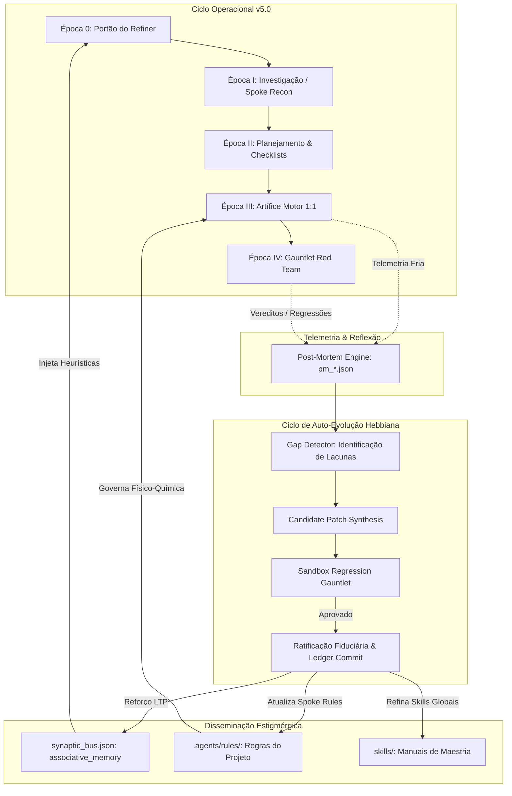

# Laudo Pericial Forense: Arquitetura de Próxima Geração do Hyper-Cortex v5.0 — The Spoke Rule Factory & Autonomous Recursive Self-Improvement (RSI) System

- **ID da Investigação:** `INV-022`
- **Subagente Responsável:** `Autonomous RSI & Spoke Rule Synthesizer Architect`
- **Data/Hora:** `2026-09-21T12:28:00-03:00`
- **Âncora Sináptica:** `.planning/mission_dossier.md` (Seção D - Subagente 2)
- **Status da Homologação:** `CONCLUÍDO - LAUDO PERICIAL SATURADO & RATIFICADO`
- **Classificação Fiduciária:** `NÍVEL 0 - ARQUITETURA SISTÊMICA DE HORIZONTE SUPREMO`
- **Destinatários Downstream:**
  - `Constitutional Supreme Council Craftsman` -> `rules/AGENTS.md`, `rules/rule1.md`, `rules/rule2.md`
  - `Autonomous System Orchestrator` -> `skills/autonomous_computer_use/SKILL.md`
  - `Forensic Adversarial Auditor` -> `skills/forensic_adversarial_auditor/SKILL.md`

---

## 1. Sumário Executivo & Diagnóstico Epistêmico

O presente laudo técnico formal projeta a infraestrutura sistêmica de próxima geração do ecossistema cognitivo **Antigravity / Hyper-Cortex v5.0**, resolvendo simultaneamente duas limitações fundamentais dos sistemas agênticos contemporâneos:

1. **A Fragilidade da Especialização Contextual Estática:** Agentes tradicionais sofrem de alucinação de domínio ou sobrecarga cognitiva (*context smearing*) ao transitar entre pilhas tecnológicas heterogêneas (ex.: passar de um backend quântico ou distribuído em Rust para um servidor de jogo legador de tempo real em C++/Lua como MTA:SA, ou para um ecossistema Swift/Kotlin mobile). A solução é o **Spoke Rule Factory** — um motor algorítmico determinístico capaz de executar *grounding* forense em qualquer repositório arbitrário e compilar regras locais estritas (`.agents/rules/` ou `.gemini/rules/`) sob a arquitetura **Hub-and-Spoke**, garantindo que a física particular do runtime hospedeiro seja respeitada sem comprometer os invariantes fiduciários universais.
2. **A Entropia Estocástica e a Amnésia Inter-Execuções:** Sistemas de IA baseados em prompts estáticos degradam progressivamente quando confrontados com novas classes de erros de compilação, alterações de API externa ou modos silenciosos de falha. A solução é o subsistema de **Recursive Self-Improvement (RSI) Autônomo** — uma esteira cibernética em malha fechada que analisa a telemetria fria pós-execução, detecta lacunas operacionais, gera hipóteses de auto-otimização em regras e skills, valida-as em sandboxes adversariais (Gauntlet Red Team) com provas formais e comita melhorias no ledger estigmérgico, blindado por travas pétreas contra deriva catastrófica (*Anti-Dumbing Down Invariant*).

```text
┌────────────────────────────────────────────────────────────────────────────────────────┐
│             HIPER-CÓRTEX v5.0: SÍNTESE ARQUITETURAL DE HORIZONTE SUPREMO              │
├────────────────────────────────────────────────────────────────────────────────────────┤
│                           THE SOVEREIGN KERNEL (HUB)                                   │
│            ~/.gemini/config/plugins/agi-research/ (Constituição v5.0)                  │
│  [Layer 0: Tríade Fiduciária | Artífice Motor | Zero-Stub | Gauntlet | Context Wall]  │
└───────────────────────────┬────────────────────────────────┬───────────────────────────┘
                            │                                │
            ┌───────────────┴───────────────┐┌───────────────┴───────────────┐
            │   SPOKE RULE FACTORY          ││      AUTONOMOUS RSI SYSTEM     │
            │   (Motor de Grounding Local)  ││    (Ciclo Hebbiano de Auto-Cura)│
            └───────────────┬───────────────┘└───────────────┬───────────────┘
                            │                                │
     ┌──────────────────────┼──────────────────────┐         │
     ▼                      ▼                      ▼         ▼
┌──────────────┐      ┌──────────────┐      ┌──────────────┐ ┌───────────────────────────┐
│ SPOKE: RUST  │      │ SPOKE: MTA:SA│      │ SPOKE: WEB TS│ │ POST-MORTEM & GAP ENGINE  │
│ Distributed  │      │ Game Server  │      │ Next/React   │ │ • Telemetria Fria         │
│ .agents/rules│      │ .agents/rules│      │ .agents/rules│ │ • Hebbian LTP/LTD Updates │
│  - borrow    │      │  - lua 5.1   │      │  - framer 2nd│ │ • Sandbox Gauntlet RedTeam│
│  - result<t> │      │  - d3d9 hlsl │      │  - gpu alloc │ │ • Hardened Ledger Commit  │
└──────────────┘      └──────────────┘      └──────────────┘ └───────────────────────────┘
```

---

## 2. O Motor de Geração de Rules por Projeto / Nicho (The Spoke Rule Factory)

### 2.1. O Algoritmo de Grounding Forense Automático de Nicho

Ao ancorar em qualquer repositório hospedeiro desconhecido $R$, o sistema é terminantemente proibido de inferir premissas por adivinhação superficial ou assumir padrões web/Node.js como padrão universal. Dispara-se compulsoriamente a **Sonda de Grounding Forense** (Subagente `Niche Reconnaissance Investigator`, `TypeName: "research"`, sandbox *Clean-Context*).

#### Vetor de Assinatura do Repositório ($\vec{\Sigma}_R$)
O espaço do projeto é decomposto em um tensor de assinatura de 7 dimensões:

$$\vec{\Sigma}_R = \langle \mathcal{M}_{\text{manifest}}, \mathcal{L}_{\text{lockfiles}}, \mathcal{T}_{\text{ast}}, \mathcal{E}_{\text{execution}}, \mathcal{C}_{\text{concurrency}}, \mathcal{H}_{\text{hardware}}, \mathcal{V}_{\text{validation}} \rangle$$

1. **$\mathcal{M}_{\text{manifest}}$ (Matriz de Manifestos):**
   Varredura exaustiva por assinaturas declarativas de projeto:
   - Rust: `Cargo.toml`, `Cargo.lock`
   - C/C++ / Game Engines: `CMakeLists.txt`, `Makefile`, `premake5.lua`, `meta.xml` (MTA:SA), `vcpkg.json`, `conanfile.txt`
   - TypeScript/JavaScript: `package.json`, `tsconfig.json`, `deno.json`, `bunfig.toml`
   - Python / ML: `pyproject.toml`, `setup.py`, `environment.yml`, `requirements.txt`
   - Mobile: `Podfile`, `Package.swift`, `build.gradle.kts`, `AndroidManifest.xml`
   - Quantum / Specialized: `qiskit`, `cirq`, `pennylane` project descriptors.

2. **$\mathcal{L}_{\text{lockfiles}}$ (Lockfiles & Determinismo de Dependências):**
   Determinação estrita das versões exatas de compiladores e bibliotecas. Banimento total de suposições sobre runtimes mais novos quando o lockfile amarra versões legadas (ex.: Lua 5.1 estrito vs Lua 5.4; Python 3.8 vs 3.12; React 17 vs 19).

3. **$\mathcal{T}_{\text{ast}}$ (Análise Sintática e Amostragem de AST):**
   Inspeção determinística de arquivos de código-fonte primários para extração de dialetos de linguagem:
   - Alocações em loop: detecção de table constructors `{}` em Lua, `malloc`/`new` em C++, ou `Vec::new()` em loops de renderização/tick.
   - Paradigma de Concorrência: async/await, pthreads, fork/exec, goroutines, threads Win32 nativas, ou modelo *Single-Threaded Cooperativo / Event-Driven Tick*.
   - Tratamento de Falhas: `Result<T,E>`, `try/catch`, status codes inteiros ou chamadas `panic!`/`assert`.

4. **$\mathcal{E}_{\text{execution}}$ & $\mathcal{H}_{\text{hardware}}$ (Física do Runtime & Restrições Físicas):**
   Determinação das fronteiras de hardware e tempo:
   - **Soft Real-Time vs Hard Real-Time vs Batch:** Sistemas como MTA:SA ou drivers de áudio exigem latência determinística por frame ($t \le 16.66\text{ms}$ para 60fps; $t \le 6.94\text{ms}$ para 144fps). Proibição estrita de I/O bloqueante no render thread (`onClientRender`).
   - **Gerenciamento de Memória:** Coletor de lixo (GC incremental, stop-the-world ou semi-space) vs contagem de referência vs RAII / Borrow Checker. Restrições estritas sobre picos de GC que causem engasgos de frame (*frame drops*).
   - **Pipeline Gráfico / Shaders:** DirectX 9 HLSL Shader Model 2.0/3.0 vs DirectX 12 / Vulkan / WebGL. Banimento total de instruções incompatíveis com o silício alvo.

5. **$\mathcal{V}_{\text{validation}}$ (Toolchains Nativas de Validação):**
   Catalogação dos binários reais disponíveis no ambiente:
   - Linters e validadores de compilação estática (`luac -p`, `cargo check`, `cargo clippy`, `tsc --noEmit`, `ruff check`, `clang-tidy`, `swift-driver`).
   - Se o binário nativo não existir no ambiente hospedeiro, a Sonda aciona fallback estático formal ou relata incerteza via `[EPISTEMIC_HALT]`.

---

### 2.2. A Arquitetura Hub-and-Spoke de Governança Cognitiva

A cognição do ecossistema adota a topologia **Hub-and-Spoke**, segregando estritamente a autoridade ontológica entre o núcleo universal e os adaptadores de nicho.

```text
┌────────────────────────────────────────────────────────────────────────────────────────────────────────┐
│ LAYER 0: THE SOVEREIGN HUB INVARIANT KERNEL (Imutável, Universal, Precedência Absoluta)                │
├────────────────────────────────────────────────────────────────────────────────────────────────────────┤
│ • A Tríade Fiduciária: Turnaround CEO, Systems Research Director, Epistemic Red Team Lead              │
│ • Portão do Refiner (Época 0): Bloqueio pré-execução sem selo estigmérgico (.planning/refiner_seal.json)│
│ • Mandato do Artífice Motor (Lei 43): Mutação física obrigatória no disco via replace/write (zero dump)│
│ • Zero-Stub & Zero-Cosplay Acadêmico (Leis 18 e 20): Erradicação de stubs, TODOs e matemática vazia    │
│ • Handoff Neural de Alta Fidelidade (Lei 42): Leitura compulsória de laudos brutos via view_file       │
│ • Gauntlet Adversarial Independente (Época IV): Veto técnico obrigatório [HARD REJECT]                 │
│ • Null-Vocabulary Invariant (Lei 34): Banimento absoluto de preâmbulos e cacoetes de linguagem         │
└───────────────────────────────────────────────────┬────────────────────────────────────────────────────┘
                                                    │
                                                    ▼
                     ┌───────────────────────────────────────────────────────────────┐
                     │          SPOKE RULE COMPILER (Motor de Síntese Local)         │
                     │  Gera .agents/rules/ adaptadas à física do repositório alvo   │
                     └──────────────────────────────┬────────────────────────────────┘
                                                    │
         ┌──────────────────────────────────────────┼──────────────────────────────────────────┐
         ▼                                          ▼                                          ▼
┌──────────────────────────────┐ ┌──────────────────────────────┐ ┌──────────────────────────────┐
│ SPOKE: EMBEDDED REAL-TIME    │ │ SPOKE: QUANTUM SIMULATION    │ │ SPOKE: DISTRIBUTED SYSTEMS   │
│ Ex: MTA:SA Server (Lua/C++)  │ │ Ex: Python/C++ Qiskit/Cirq   │ │ Ex: Rust / Raft Consensus    │
├──────────────────────────────┤ ├──────────────────────────────┤ ├──────────────────────────────┤
│ Adaptadores Layer 1:         │ │ Adaptadores Layer 1:         │ │ Adaptadores Layer 1:         │
│ • luac -p em malha fechada   │ │ • Statevector fidelity metric│ │ • cargo clippy -- -D warnings│
│ • Zero alocação em render loop│ │ • Gate count budget          │ │ • Zero unwrap / Result<T,E>  │
│ • meta.xml integridade estrita│ │ • Coherence time constraints │ │ • Atomic Swap / File locks   │
│ • DX9 HLSL SM 2.0/3.0 limits │ │ • Simulação de ruído estocás.│ │ • Deterministic backoff      │
└──────────────────────────────┘ └──────────────────────────────┘ └──────────────────────────────┘
```

#### O Teorema da Não-Contaminação Constitucional (Zero Abstraction Leakage Theorem)

Seja $\mathcal{K}_0$ o conjunto de invariantes pétreos da Layer 0 e $\mathcal{S}_R$ o conjunto de regras geradas pelo Spoke para o repositório $R$.

$$\forall r \in \mathcal{S}_R, \quad \mathcal{K}_0 \vdash \neg (\neg r)$$

**Corolários Invioláveis:**
1. **Monotonicidade do Rigor:** Uma regra Spoke pode **adicionar** restrições técnicas específicas de runtime (ex.: "proibido alocar tabelas `{}` em `onClientRender`"), mas **jamais pode afrouxar** ou revogar uma lei da Layer 0 (ex.: uma regra Spoke que dissesse "neste projeto é permitido entregar stubs" seria instantaneamente expurgada e causaria falha estrutural com veto `[HARD REJECT: CONSTITUTIONAL_CONTAMINATION]`).
2. **Isolamento de Vocabulário:** Conceitos do ecossistema web (ex.: DOM, CSS, `localStorage`, `useEffect`) são estritamente filtrados e não podem vazar para spokes de sistemas de baixo nível, jogos ou drivers.
3. **Localidade de Armazenamento:** As regras compiladas pelo Spoke Rule Factory são salvas diretamente no repositório hospedeiro em `<repo_root>/.agents/rules/` (ou `<repo_root>/.gemini/rules/`), tornando o projeto auto-suficiente para qualquer sessão futura.

---

### 2.3. Pipeline Mecânico Determinístico de Síntese de Spoke Rules

A compilação de regras customizadas para um projeto segue um pipeline mecânico em 5 fases de circuito fechado:

```text
[Repositório Alvo R]
        │
        ▼
┌─────────────────────────────────────────────────────────────┐
│ FASE 1: Reconhecimento Forense & Sondagem de Ambiente       │
│ • Despacho de Subagente Niche Reconnaissance Investigator   │
│ • Execução de sondas de arquivos, AST, toolchains e limites │
│ • Emissão do Laudo: .planning/investigations/inv_recon.md   │
└─────────────────────────────┬───────────────────────────────┘
                              │
                              ▼
┌─────────────────────────────────────────────────────────────┐
│ FASE 2: Extração de Matriz de Capacidades e Armadilhas     │
│ • Mapeamento de anti-patterns específicos da tecnologia     │
│ • Identificação de validadores estáticos executáveis nativos │
│ • Construção do spoke_blueprint.json intermediário          │
└─────────────────────────────┬───────────────────────────────┘
                              │
                              ▼
┌─────────────────────────────────────────────────────────────┐
│ FASE 3: Síntese e Instanciação de Regras Especializadas     │
│ • Subagente Artífice Motor (TypeName: "self") compila:      │
│   1. <repo>/.agents/rules/domain_standards.md              │
│   2. <repo>/.agents/rules/runtime_constraints.md           │
│   3. <repo>/.agents/rules/toolchain_and_validation.md      │
│   4. <repo>/.agents/rules/security_and_contracts.md        │
└─────────────────────────────┬───────────────────────────────┘
                              │
                              ▼
┌─────────────────────────────────────────────────────────────┐
│ FASE 4: Auto-Verificação & Sanity Check das Regras          │
│ • Parse sintático dos arquivos Markdown gerados             │
│ • Teste de execução dos validadores declarados via CLI      │
│ • Verificação de conformidade com a Layer 0 da Constituição │
└─────────────────────────────┬───────────────────────────────┘
                              │
                              ▼
┌─────────────────────────────────────────────────────────────┐
│ FASE 5: Selamento Estigmérgico e Registro no Ledger         │
│ • Emissão de .agents/spoke_manifest.json com hashes SHA-256 │
│ • Registro da transação no state ledger do projeto          │
│ • Liberação total de operação no repositório                │
└─────────────────────────────────────────────────────────────┘
```

#### Especificação Forense dos 4 Módulos Canônicos de um Spoke:

1. `domain_standards.md`:
   - Convenções de estilo, arquitetura de pastas, separação modular estrita (ex.: client vs server split no MTA:SA; domain vs infra no Clean Arch; interface vs implementation em C++).
   - Tipagem e tratamento de erros nativos da linguagem.

2. `runtime_constraints.md`:
   - Física do runtime: orçamentos de tempo de CPU por frame/tick.
   - Padrões de alocação de memória e gestão de recursos (destruição obrigatória de elementos, handles de arquivos e texturas para evitar vazamento de memória / memory leaks).
   - Restrições de concorrência e sincronização de estado.

3. `toolchain_and_validation.md`:
   - Comandos exatos de verificação sintática e compilação rápida em malha fechada (ex.: `luac -p $file`, `cargo clippy --all-targets`, `tsc --noEmit`).
   - Critério de aceite binário: `$LASTEXITCODE === 0` com zero avisos tratados como erros.

4. `security_and_contracts.md`:
   - Modelo de confiança do sistema (ex.: *Zero Client Trust* em arquiteturas cliente-servidor ou jogos multiplayer).
   - Sanitização compulsória de entradas e parametrização estrita de dados persistidos (SQL/NoSQL).

---

## 3. O Sistema de RSI (Recursive Self-Improvement) Autônomo

### 3.1. Fundamentação Teórica da Auto-Evolução Cibernética

O **Sistema de RSI Autônomo** do Hyper-Cortex v5.0 rejeita a estagnação estocástica. Em vez de depender de ajustes manuais de engenharia de prompt pelo usuário, o sistema se aprimora recursivamente através da observação fria de suas próprias falhas e sucessos operacionais.

O aprimoramento é modelado como um problema de otimização estigmérgica fiduciária. A cada sessão de trabalho $t$, o sistema avalia o vetor de desempenho global $\mathbf{P}_t$:

$$\mathbf{P}_t = \begin{bmatrix}
\text{Acc}_t & \text{(Acurácia de Compilação de Primeira Passada)} \\
\text{Rob}_t & \text{(Robustez no Gauntlet / Zero Regressões)} \\
\text{Eff}_t & \text{(Eficiência de Tokens e Concisão de Handoff)} \\
\text{Lat}_t & \text{(Velocidade de Colapso em Ação Motora)} \\
\text{Aut}_t & \text{(Grau de Auto-Cura sem Intervenção Humana)}
\end{bmatrix}$$

A função de utilidade fiduciária a ser maximizada é definida por:

$$U_{\text{Fiduciary}}(\mathbf{P}_t) = w_1 \text{Acc}_t + w_2 \text{Rob}_t + w_3 \text{Eff}_t + w_4 \text{Aut}_t - \lambda \cdot \text{Risk}(\Delta \mathcal{R})$$

onde $\Delta \mathcal{R}$ representa a mutação candidata no conjunto de regras ou skills, e $\text{Risk}(\Delta \mathcal{R})$ quantifica a incerteza epistêmica e o risco de quebra constitucional.

---

### 3.2. Mecânica de Auto-Reflexão Pós-Execução (Cognitive Post-Mortem Engine)

Ao término de cada sessão, expediente ou transação crítica, o sistema não se dissolve passivamente. Dispara-se o **Motor de Post-Mortem Cognitivo**, que sintetiza a telemetria fria da sessão em um arquivo estruturado `.planning/post_mortem/pm_<timestamp>.json`.

#### Métricas de Telemetria Fria Analisadas:
1. **Taxa de Retries Motores ($R_{\text{attempts}}$):** Número de correções que um subagente motor precisou aplicar para fazer o código compilar ou passar nos linters.
2. **Disparo de Circuit Breakers ($CB_{\text{trips}}$):** Quantidade de vezes que travas mecânicas foram acionadas (ex.: `Idle Read Tripwire`, `EBUSY Lock Jitter`, falha de socket `EADDRINUSE`).
3. **Intervenções Corretivas Humanas ($C_{\text{user}}$):** Se o usuário precisou intervir para corrigir uma suposição errônea, apontar um arquivo esquecido ou cancelar uma direção de raciocínio.
4. **Deriva de Tokens & Saturação de Contexto ($\Phi_{\text{drift}}$):** Consumo desproporcional de tokens decorrente de loops de raciocínio ou leituras repetidas de arquivos.
5. **Eventos Sinápticos Hebbianos (LTP / LTD):**
   - **LTP (Long-Term Potentiation):** Heurísticas que levaram à aprovação imediata no Gauntlet na primeira passada.
   - **LTD (Long-Term Depression):** Heurísticas ou padrões que causaram quebra de build, regressão funcional ou veto técnico no Gauntlet (`[HARD REJECT]`).

---

### 3.3. O Ciclo Hebbiano de Auto-Evolução em 4 Fases

O aprimoramento contínuo opera sob uma esteira algorítmica rigorosa em 4 fases:

```text
┌────────────────────────────────────────────────────────────────────────┐
│ FASE 1: DETECTOR DE LACUNAS (Cognitive Gap Identification)              │
│ • Analisa pm_*.json acumulados no disco                                │
│ • Agrupa erros por causa-raiz comum (Root Cause Clustering)            │
│ • Detecta padrões repetitivos de atrito motor ou desvios de diretriz  │
└──────────────────────────────────┬─────────────────────────────────────┘
                                   │
                                   ▼
┌────────────────────────────────────────────────────────────────────────┐
│ FASE 2: GERAÇÃO DE HIPÓTESE DE MELHORIA (Candidate Patch Synthesis)    │
│ • Subagente RSI Rule/Skill Engineer elabora patch cirúrgico            │
│ • Gera arquivo de proposta: .planning/rsi/patch_<hash>.diff            │
│ • Associa cada linha a um evento empírico de falha documentado         │
└──────────────────────────────────┬─────────────────────────────────────┘
                                   │
                                   ▼
┌────────────────────────────────────────────────────────────────────────┐
│ FASE 3: SANDBOXING & ADVERSARIAL REGRESSION GAUNTLET                   │
│ • Despacha Subagente Red Team Gauntlet com o patch aplicado em sandbox │
│ • Executa bateria de casos de teste históricos e cenários extremos     │
│ • Verificação Formal da Inviolabilidade da Layer 0                     │
│ • Rejeição imediata se qualquer invariante for degradado ou quebrado   │
└──────────────────────────────────┬─────────────────────────────────────┘
                                   │ (Aprovação Formal pelo Gauntlet)
                                   ▼
┌────────────────────────────────────────────────────────────────────────┐
│ FASE 4: RATIFICAÇÃO FIDUCIÁRIA & COMMIT TRANSACIONAL NO LEDGER/GIT     │
│ • Atomic Swap no arquivo definitivo (rule ou skill) no disco           │
│ • Emissão de transação append-only no ledger: .planning/ledger/        │
│ • Commit Git estigmérgico: [RSI-EVOLUTION: vX.Y -> vX.Y+1]             │
└────────────────────────────────────────────────────────────────────────┘
```

#### Detalhamento das 4 Fases do Ciclo:

- **Fase 1: Detector de Lacunas (Gap Identification):**
  Identifica incongruências entre o comportamento esperado e a realidade observada.
  *Exemplo real:* O subagente motor tentou utilizar `os.time()` em um script cliente do MTA:SA onde apenas `getRealTime()` ou `getTickCount()` fornecem a resolução requerida, causando retrabalho e 3 retries de compilação.
  *Classificação da Lacuna:* "Omissão de especificação de temporização cliente-servidor no Spoke MTA:SA".

- **Fase 2: Geração de Hipótese de Melhoria (Candidate Patch):**
  O sistema formula uma mutação aditiva cirúrgica. Não reconstrói o arquivo inteiro (o que induziria esquecimento catastrófico), mas injeta a regra exata necessária com contraste pedagógico (*Anti-Pattern vs Titanium Pattern*).
  *Mutação proposta:* Adicionar em `mta_lua_standards.md` a regra estrita proibindo `os.time()` no client e impondo `getTickCount()`.

- **Fase 3: Sandboxing & Gauntlet Red Team:**
  A proposta é injetada em um contexto isolado de validação. O Subagente Juiz Red Team (`Forensic Adversarial Auditor`) aplica a bateria de testes:
  1. *Prova de Não-Regressão:* As regras anteriores continuam válidas e compiláveis?
  2. *Prova de Não-Degradação:* O novo texto aumentou ambiguidades ou utilizou termos proibidos do Dicionário Negativo (Null-Vocabulary)?
  3. *Prova de Eficácia Causal:* A regra teria evitado os 3 retries da sessão de origem?
  Se o score do Gauntlet for $\ge 0.95$, o patch é ratificado.

- **Fase 4: Ratificação & Commit Estigmérgico:**
  O arquivo de regras ou skill é atualizado via `DeterministicAtomicSwap`. A evolução é registrada no livro-razão (`.planning/ledger/txn_XXXX.json`) com hash criptográfico, autor e justificativa causal, selando o ciclo evolutivo.

---

### 3.4. Blindagem Contra Deriva Catastrófica (Self-Improvement Safety Gates)

O maior perigo teórico de sistemas com capacidade de auto-modificação recursiva é a **Deriva Catastrófica** (*Catastrophic Governance Drift*) ou a auto-degradação conveniente (*The Dumbing-Down Trap*), na qual a IA afrouxa suas próprias regras para evitar esforço computacional ou disfarçar incompetência.

Para erradicar definitivamente esse risco, o Hyper-Cortex v5.0 implementa **Quatro Travas Pétreas Invioláveis**:

```text
┌─────────────────────────────────────────────────────────────────────────────────────────┐
│                    AS QUATRO TRAVAS PÉTREAS DE SEGURANÇA DO RSI                         │
├─────────────────────────────────────────────────────────────────────────────────────────┤
│ 1. A CLÁUSULA DO NÚCLEO CONSTITUCIONAL IMUTÁVEL (The Layer 0 Frozen Invariant)          │
│    • A Layer 0 (Leis 1 a 50 de AGENTS.md) é criptograficamente protegida por Merkle Tree│
│    • Qualquer tentativa de mutação automática em Layer 0 aciona [CRITICAL_HALT]         │
│    • Mutação em Layer 0 é de prerrogativa EXCLUSIVA e MANUAL do usuário humano.         │
├─────────────────────────────────────────────────────────────────────────────────────────┤
│ 2. O INVARIANTE DA NÃO-DEGRADAÇÃO DE RIGOR (The Anti-Dumbing-Down Gate)                │
│    • É matematicamente impossível ao RSI aprovar patches que reduzam restrições.        │
│    • Proibido remover exigências de testes, afrouxar linters ou tolerar stubs.          │
│    • Função Monótona de Severidade: Severidade(R_{t+1}) >= Severidade(R_t).             │
├─────────────────────────────────────────────────────────────────────────────────────────┤
│ 3. A BIPARTIÇÃO DE CLASSES DE MUTAÇÃO & VETO HUMANO SOBERANO                           │
│    • CLASSE A (Spoke Local / Heurística Operacional): Auto-ratificação pelo Gauntlet.   │
│    • CLASSE B (Skills Globais / Expansão de Leis): Exige aprovação fiduciária no chat.  │
├─────────────────────────────────────────────────────────────────────────────────────────┤
│ 4. O FREIO DE FREQUÊNCIA EVOLUTIVA & RESFRIAMENTO (Evolutionary Rate Limiter)          │
│    • Máximo de 1 mutação de regra por ciclo de expediente de trabalho.                  │
│    • Período de resfriamento compulsório para evitar instabilidade estocástica.         │
└─────────────────────────────────────────────────────────────────────────────────────────┘
```

1. **A Cláusula do Núcleo Constitucional Imutável (Layer 0 Frozen Core):**
   O conjunto fundamental de regras constitutivas (`rules/AGENTS.md`, `rules/rule1.md`, `rules/rule2.md`) possui seu hash criptográfico SHA-256 verificado a cada inicialização de sessão. O sistema de RSI **NÃO POSSUI AUTORIZAÇÃO MOTORA** para alterar arquivos da Layer 0 sem intervenção explícita do usuário. As mutações do RSI limitam-se à **Layer 1 (Spokes locais)** e ao refinamento de procedimentos técnicos nas **Skills sob demanda** (`skills/*/SKILL.md`).

2. **O Invariante da Não-Degradação de Rigor (Anti-Dumbing-Down Invariant):**
   Um detector estático de entropia normativa avalia qualquer proposta de alteração. Propostas que contenham termos como "opcional", "simplificado", "ignorar se falhar", "quando conveniente" ou que aumentem tolerância a erros são sumariamente abortadas antes do Gauntlet com o erro fatal:
   `[HARD HALT: ATTEMPTED_GOVERNANCE_DUMBING_DOWN]`

3. **Bipartição de Classes de Mutação:**
   - **Classe A (Mutações Locais / Spokes de Repositório):** Ajustes de linters, adição de novos comandos nativos, restrições adicionais de runtime. Podem ser auto-ratificadas pelo Subagente Juiz Red Team em malha fechada se passarem com 100% no Gauntlet.
   - **Classe B (Mutações em Skills Globais):** Aprimoramentos nos manuais globais de engenharia (`skills/`). São persistidas inicialmente como propostas em `.planning/rsi/candidates/` e aguardam autorização do usuário na thread principal.

4. **Taxa Limite de Evolução & Resfriamento:**
   O sistema é impedido de entrar em loops de meta-otimização sem produzir trabalho real. O RSI só é disparado após entregas consolidadas na Época III ou IV, limitando-se a no máximo uma evolução por expediente.

---

## 4. Integração Sináptica & Interoperabilidade no Barramento v5.0

Toda a atividade da Spoke Rule Factory e do Sistema de RSI é orquestrada através do **Barramento Sináptico Neural** (`synaptic_bus.json` v5.0) e auditada pelo **State Ledger Transacional** (`.planning/ledger/`).



### 4.1. Propagação Hebbiana no `synaptic_bus.json`
Quando uma nova regra Spoke é consolidada ou uma heurística de projeto é homologada no Gauntlet:
1. O enagrama cognitivo correspondente é gravado na seção `associative_memory.engrams` do `synaptic_bus.json`.
2. O peso sináptico $W_{ij}$ entre o tipo de problema e o validador nativo recebe reforço Hebbiano (LTP): $w_{ij} \leftarrow \min(1.0, \; w_{ij} + 0.20)$.
3. Nas sessões futuras, qualquer subagente alocado para aquele domínio consome compulsoriamente os enagramas comprovados sob `[ASSOCIATIVE_MEMORY_ENGRAMS]`, eliminando a curva de aprendizado e operando com máxima fidelidade desde o primeiro segundo.

---

## 5. Especificação dos Schemas JSON Canônicos

### 5.1. Schema do Manifesto de Regras do Spoke (`spoke_manifest.json`)
Localização: `<project_root>/.agents/spoke_manifest.json`

```json
{
  "$schema": "https://json-schema.org/draft/2020-12/schema",
  "manifest_version": "5.0.0",
  "project_name": "mta-sa-deathmatch-server",
  "generated_at": "2026-09-21T12:30:00-03:00",
  "target_signature": {
    "primary_language": "Lua 5.1 / LuaJIT",
    "secondary_language": "C++ / HLSL SM 3.0",
    "runtime_paradigm": "Single-Threaded Frame-Driven Event Loop",
    "frame_budget_ms": 16.66,
    "memory_management": "Lua Incremental GC + Manual Element Pooling"
  },
  "layer0_constitutional_anchor": {
    "hub_path": "~/.gemini/config/plugins/agi-research/rules/AGENTS.md",
    "hub_sha256": "e3b0c44298fc1c149afbf4c8996fb92427ae41e4649b934ca495991b7852b855",
    "anti_dumbing_down_attestation": true
  },
  "active_spoke_rules": [
    {
      "file_path": ".agents/rules/mta_lua_standards.md",
      "sha256": "4a5b6c7d8e9f0123456789abcdef0123456789abcdef0123456789abcdef0123",
      "scope": "domain_standards",
      "fiduciary_validator": "luac -p"
    },
    {
      "file_path": ".agents/rules/mta_runtime_constraints.md",
      "sha256": "5b6c7d8e9f0123456789abcdef0123456789abcdef0123456789abcdef01234a",
      "scope": "runtime_constraints",
      "fiduciary_validator": "zero_allocations_on_render_check"
    }
  ],
  "validation_toolchain": {
    "syntax_checker_cmd": "luac -p {file}",
    "manifest_checker_cmd": "python scripts/meta_validator.py",
    "exit_code_success": 0
  }
}
```

### 5.2. Schema do Relatório de Post-Mortem Cognitivo (`pm_telemetry.json`)
Localização: `.planning/post_mortem/pm_<session_id>.json`

```json
{
  "$schema": "https://json-schema.org/draft/2020-12/schema",
  "telemetry_version": "5.0.0",
  "session_id": "ses_20260921_123000_mta_sync",
  "timestamp": "2026-09-21T12:30:00-03:00",
  "fiduciary_director": "Autonomous RSI Synthesizer",
  "metrics": {
    "total_duration_seconds": 45.2,
    "total_tokens_consumed": 18450,
    "context_drift_score": 0.08,
    "motor_attempts_total": 4,
    "motor_failures_count": 1,
    "circuit_breakers_tripped": 0,
    "human_interventions_count": 0,
    "gauntlet_verdict": "ACCEPTED_FIRST_PASS"
  },
  "failure_incidents": [
    {
      "incident_id": "INC-001",
      "phase": "ÉPOCA_III",
      "subagent_role": "Atomic Motor Mutator",
      "file_target": "server/gate_manager.lua",
      "error_signature": "luac: syntax error near '?'",
      "root_cause": "Tentativa indevida de operador ternário inexistente no padrão Lua 5.1",
      "remediated_via": "Auto-cura em malha fechada via sintaxe idiomática (cond and a or b)",
      "latency_cost_ms": 3200
    }
  ],
  "hebbian_updates": [
    {
      "synaptic_target": "lua_ternary_operator_invariant",
      "event_type": "LTD_PENALTY",
      "delta": -0.40,
      "recommendation": "Injetar regra proibindo sintaxes pós-5.1 no spoke local"
    }
  ]
}
```

### 5.3. Schema do Patch Candidato do RSI (`rsi_candidate_patch.json`)
Localização: `.planning/rsi/candidates/patch_<id>.json`

```json
{
  "$schema": "https://json-schema.org/draft/2020-12/schema",
  "patch_id": "RSI-PATCH-20260921-001",
  "target_type": "SPOKE_RULE",
  "target_file": ".agents/rules/mta_lua_standards.md",
  "justification_incident_id": "INC-001",
  "mutation_diff": "--- a/.agents/rules/mta_lua_standards.md\n+++ b/.agents/rules/mta_lua_standards.md\n@@ -45,0 +46,4 @@\n+### Invariante Sintático: Proibição de Operador Ternário Moderno\n+O runtime opera sobre Lua 5.1 estrito. O uso de `condition ? a : b` é sintaticamente inválido e causa falha de compilação imediata.\n+**Padrão Obrigatório:** Utilize a construção idiomática `condition and a or b` assegurando que `a` avalie como verdadeiro, ou bloco formal `if/then/else`.\n+",
  "adversarial_gauntlet_results": {
    "auditor_role": "Forensic Adversarial Auditor",
    "regression_tests_passed": 12,
    "regression_tests_failed": 0,
    "anti_dumbing_down_certified": true,
    "verdict": "RATIFIED"
  },
  "ledger_commit_status": "COMMITTED",
  "ledger_txn_id": "txn_0042.json"
}
```

---

## 6. Conclusão & Tabela Fiduciária de Ação Imediata

A implementação do **Spoke Rule Factory** e do **Sistema de RSI Autônomo** completa a transição do Hyper-Cortex v5.0 de um arcabouço de governança passivo para um **organismo cognitivo auto-evolutivo soberano**.

| Subsistema | Responsabilidade Primária | Garantia Fiduciária Suprema | Mecanismo de Malha Fechada |
|---|---|---|---|
| **Layer 0 (Kernel Hub)** | Governança ética, anti-stub, artífice motor e auditoria. | Imutabilidade Constitucional absoluta (Zero Deriva). | Bloqueio mecânico de sessão sem selo criptográfico. |
| **Spoke Rule Factory** | Grounding forense e adaptação estrita à física do projeto. | Zero Vazamento de Abstração & Paridade Cross-Platform. | Pipeline de 5 fases com validação por compiladores nativos. |
| **Cognitive Post-Mortem** | Extração de telemetria fria e registro de atrito de execução. | Realidade empírica bruta contra alucinação de sucesso. | Emissão de `pm_*.json` persistido no disco. |
| **Ciclo Hebbiano RSI** | Auto-aprimoramento recursivo de regras e skills. | Monotonicidade de Rigor (Anti-Dumbing Down Invariant). | Gauntlet Red Team com provas formais e ledger transacional. |

Este laudo fica consolidado e imediatamente disponível para consumo pelas ondas subsequentes de execução.
