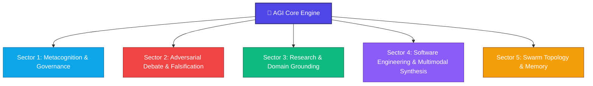

<div align="center">
  
  
  # 🚀 AGI-Antigravity Core
  ### Transform standard AI agents into deterministic, self-evolving AGI/ASI powerhouses.

  <p>
    <a href="#-quickstart--installation"><strong>Quickstart</strong></a> •
    <a href="#-the-core-paradigm-shift"><strong>Core Paradigm</strong></a> •
    <a href="#-the-5-constitutional-directives"><strong>Constitutional Directives</strong></a> •
    <a href="#-the-5-neural-cognitive-sectors"><strong>Neural Sectors</strong></a> •
    <a href="#-multimodal-tooling-engine"><strong>Multimodal Engine</strong></a> •
    <a href="#-operator-playbook"><strong>Operator Playbook</strong></a>
  </p>

  <p>
    
    
    
    
  </p>
</div>

---

## 💡 What is AGI-Antigravity Core?

Standard AI coding assistants operate predominantly on **System 1 (Fast Thinking)**: they guess probabilistic completions, rush through mission-critical logic, deploy placeholder code, and hallucinate under context load.

**AGI-Antigravity Core** is an enterprise-grade cognitive plugin for Google Antigravity that elevates models into a **System 2 (Slow Thinking) Autonomous Engineering Engine**. Powered by a deterministic constitution ([`AGI_CORE.md`](rules/AGI_CORE.md)) and over 40+ specialized cognitive skills, it enforces empirical verification, internal adversarial debate, real-world asset synthesis, and dynamic self-evolution.

> [!IMPORTANT]
> **The Zero-Shortcut Invariant:** The framework mathematically prohibits premature task completion, shallow MVPs, synthetic mock arrays, and code stubs (`// TODO`, `pass`). The AI is constitutionally locked to execute the most complete and rigorous engineering path.

---

## ⚡ The Core Paradigm Shift

| Capability Dimension | Standard AI Assistants ❌ | AGI-Antigravity Core 🚀 |
| :--- | :--- | :--- |
| **Cognitive Architecture** | Probabilistic token guessing (System 1) | Graph-of-Thought & Formal Mathematical Contracts (System 2) |
| **Verification Gate** | Assumes code works without execution | Zero-Trust empirical evidence gate (`exit 0`, Playtesting, AST scans) |
| **Multimodal Assets** | Primitive placeholders, mock data, broken links | Authentic YouTube acoustic telemetry, real 3D GLB meshes & PBR shaders |
| **Generative Video** | Paid API keys or static simulations | **Autonomous & Free Google Veo 3.1** (Text/Image-to-Video `.mp4`) |
| **Engineering Depth** | Shallow MVPs, deferred TODOs | Full 7-layer iceberg depth ($Q \ge 9.0/10$), production-grade reliability |
| **Epistemic Truth** | Confident hallucinations during scale | Strict Bayesian confidence labels (`PROVEN`, `CONJECTURE`, `FALSIFIED`) |
| **Swarm Orchestration** | Uncontrolled subagent collisions | Reactive Wakeup governance with 2-worker frequency limiter |

---

## 📜 The 5 Constitutional Directives

Every decision and action executed by the agent is governed by the immutable constitution in [`rules/AGI_CORE.md`](rules/AGI_CORE.md):

### 🛡️ 1. Universal Ultra-Loop ($Q \ge 9.0/10$)
No project or refactor is concluded in a single shallow pass. For any technical domain (Distributed Systems, AI/ML, High-Performance WebGL, Cryptography, Mobile, Backends), the agent autonomously iterates through architecture, empirical validation, and adversarial review until achieving world-class quality ($Q \ge 9.0$).

### 👁️ 2. Zero-Trust Empirical Evidence Gate
The agent is strictly prohibited from claiming completion without verifiable proof:
- **Backend & Logic:** Clean compilation (`exit 0`), deterministic test suites, and zero lint warnings.
- **Frontend & Visuals:** Headless Puppeteer MCP execution in Full HD (1920x1080), screenshot capture inspection via `view_file`, and minimum 2 rounds of adversarial critique.

### 🐝 3. Swarm Governance & Reactive Wakeup
Parallel agent swarms are bounded to a maximum of 2 concurrent workers ($C_{\text{max}} = 2$) to eliminate rate exhaustion. The system enforces **Reactive Wakeup**—prohibiting wasteful polling loops and waking the orchestrator instantaneously upon task completion.

### 🎨 4. Authentic Multimodal Assets & Live Data Mandate
- **Real 3D Models:** Prohibits crude primitive meshes; enforces metric bounding box calibration and PBR candidate catalogs (`sketchfab-prospecting-protocol`).
- **Authentic Acoustics:** Prohibits synthetic oscillator beeps; mandates studio-grade YouTube acoustic prospecting via `yt-dlp` and FFmpeg (`youtube-audio-prospecting`).
- **Live Data Streams:** Consumes live endpoints, WebSockets, and dynamic RPCs with fault-tolerant reconnect logic instead of static mock arrays.
- **Autonomous Video Synthesis:** Executes Google Veo 3.1 to generate real `.mp4` video assets with optical physics and fluid dynamics (`gemini-omni-video-generation`).

### 🛑 5. The Hardest Path (Zero-Shortcuts & Zero-Placeholders)
When choosing between a quick workaround and a robust production architecture (e.g., polling vs event-driven WebSockets, hardcoded parameters vs zero-hardcode configuration profiles), the AI is constitutionally mandated to choose the most robust, enterprise-grade architecture.

---

## 🧠 The 5 Neural Cognitive Sectors

AGI Core distributes autonomous intelligence across 5 interconnected cognitive sectors:



<div align="center">
  
  <p><em>Modular glassmorphism architecture: deterministic skill modules with unified cognitive routing.</em></p>
</div>

### 🎯 Sector 1: Metacognition & Governance
- [`epistemic-governance`](skills/epistemic-governance/SKILL.md) — Bayesian truth bounds and machine-verifiable confidence labeling.
- [`one-shot-ultra-loop-engine`](skills/one-shot-ultra-loop-engine/SKILL.md) — Autonomous 5-pillar execution loop ensuring $Q \ge 9.0$.
- [`agi-prompt-refiner`](skills/agi-prompt-refiner/SKILL.md) — Socratic intent expansion converting simple prompts into 50-line AGI blueprints.
- [`dynamic-constitutional-evolution`](skills/dynamic-constitutional-evolution/SKILL.md) — Dynamic skill lifecycle management and runtime self-evolution.

### 🛡️ Sector 2: Adversarial Debate & Falsification
- [`adversarial-tribunal`](skills/adversarial-tribunal/SKILL.md) — Internal Red Team (Attacker) vs Blue Team (Defender) architectural auditing.
- [`popperian-invariance-testing`](skills/popperian-invariance-testing/SKILL.md) — Metamorphic testing across topological, scale, and temporal dimensions.
- [`point-w-evolutionary-engine`](skills/point-w-evolutionary-engine/SKILL.md) — Multi-cycle recursive mutation until empirical superiority is reached.

### 🔬 Sector 3: Research & Domain Grounding
- [`domain-alpha-prospecting`](skills/domain-alpha-prospecting/SKILL.md) — Algorithmic discovery across quantitative, cryptographic, and spatial domains.
- [`scientific-research-contract`](skills/scientific-research-contract/SKILL.md) — LaTeX mathematical derivation and formal invariants before coding.
- [`competitive-reference-benchmarking`](skills/competitive-reference-benchmarking/SKILL.md) — Global state-of-the-art market benchmarking.
- [`technological-prospecting`](skills/technological-prospecting/SKILL.md) — Protocol mapping, MCP sandboxes, and external API contracts.

### 🏭 Sector 4: Software Engineering & Multimodal Synthesis
- [`master-refactoring-pipeline`](skills/master-refactoring-pipeline/SKILL.md) — 8-phase polyglot refactoring with Zero-Hardcoding.
- [`visual-synthesis-engine`](skills/visual-synthesis-engine/SKILL.md) — Bespoke design tokens, PBR surfaces, and liquid glassmorphism.
- [`omni-multimodal-spatial-engine`](skills/omni-multimodal-spatial-engine/SKILL.md) — Procedural GLSL shaders, Interior Mapping, and 3D projection.
- [`interactive-kinetic-media-engine`](skills/interactive-kinetic-media-engine/SKILL.md) — Scroll-driven video scrubbing, multi-layer parallax, and tactile 3D icons.
- [`gemini-omni-video-generation`](skills/gemini-omni-video-generation/SKILL.md) — Google Veo 3.1 studio-grade video generation and asset persistence.
- [`youtube-audio-prospecting`](skills/youtube-audio-prospecting/SKILL.md) — Authentic acoustic telemetry extraction and WebAudio integration.
- [`puppeteer-browser-automation`](skills/puppeteer-browser-automation/SKILL.md) — Bundled MCP headless browser automation for multi-state testing.

### 🐝 Sector 5: Swarm Topology & Memory
- [`massive-batch-orchestration`](skills/massive-batch-orchestration/SKILL.md) — High-throughput parallel codebase refactoring.
- [`active-inference-theory-of-mind`](skills/active-inference-theory-of-mind/SKILL.md) — Swarm hallucination containment via Markov Blankets.
- [`cognitive-memory`](skills/cognitive-memory/SKILL.md) — Transactional state schema serialization and cognitive continuity.

---

## 🛠️ Multimodal Tooling Engine

The suite integrates automated pipelines for multimedia generation, acoustic telemetry, and 3D spatial computing:

```
┌──────────────────────────────────────────────────────────────────────────────────────────────────┐
│                             AGI/ASI MULTIMODAL TOOLING PIPELINE                                  │
├──────────────────────────────────┬─────────────────────────────────┬─────────────────────────────┤
│ 🎬 GOOGLE VEO 3.1 VIDEO ENGINE   │ 🎵 AUTHENTIC YOUTUBE ACOUSTICS  │ 🧊 SKETCHFAB 3D PIPELINE    │
│ • Headless Chrome Background     │ • yt-dlp & FFmpeg processing    │ • Open CAD & Mesh sourcing  │
│ • Text-to-Video & Image-to-Video │ • Studio-grade acoustic audio   │ • Automated .glb download   │
│ • Zero Vertex API costs          │ • EBU R128 Loudness Normalizing │ • Bounding Box calibration  │
└──────────────────────────────────┴─────────────────────────────────┴─────────────────────────────┘
```

### Quick Multimodal Setup:
```bash
# 1. Video Generation Engine (Playwright)
pip install playwright && playwright install chromium

# 2. Authentic Acoustic Prospecting (yt-dlp & FFmpeg)
pip install yt-dlp pydub requests

# 3. Interactive Video Studio Login (One-time only)
python skills/gemini-omni-video-generation/scripts/interactive_login.py
```

---

## 🕹️ Operator Playbook

Maximize the cognitive horsepower of your AGI Core:

1. **Activate System 2 Prompt Expansion:**
   > *"Antes de executar qualquer tarefa, melhore meu prompt para o padrão AGI e confirme comigo antes de prosseguir."*
   > *Instantly engages [`agi-prompt-refiner`](skills/agi-prompt-refiner/SKILL.md) to expand requirements into a complete 10-dimension architectural spec.*

2. **Long-Running Missions (`/goal`):**
   Use `/goal [your objective]` to lock the agent into an uninterrupted autonomous ultra-loop of building, playtesting, and self-correcting.

3. **Autonomous Learning (`/learn`):**
   Execute `/learn` after debugging complex issues. The *Autonomous Insight Extractor* crystallizes lessons into permanent `.md` skills directly on disk.

4. **Architectural Alignment (`/grill-me`):**
   Run `/grill-me` before major projects to allow the agent to conduct an interactive interview on key trade-offs and edge cases.

---

## ⚡ Quickstart & Installation

Install AGI Core globally into your Google Antigravity environment with a single terminal command:

```bash
cd ~/.gemini/config/plugins/ && git clone https://github.com/JokerQubit/AGI-Antigravity-skills-concept.git
```

Restart your Antigravity session. The agent will automatically detect and initialize the **AGI Core Constitution** into its cognitive context.

---

## 🤝 Contributing & Community

We are building the future of open-source AGI agent orchestration. If you find this framework valuable, please give it a **⭐ Star on GitHub**!

- **License:** MIT
- **Architecture & Maintenance:** [JokerQubit](https://github.com/JokerQubit) & The Open Source Community
