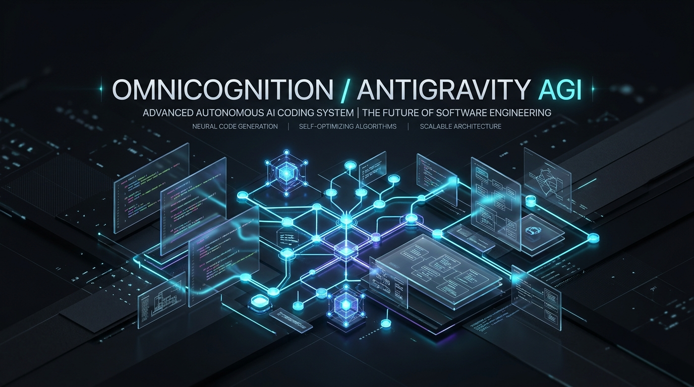
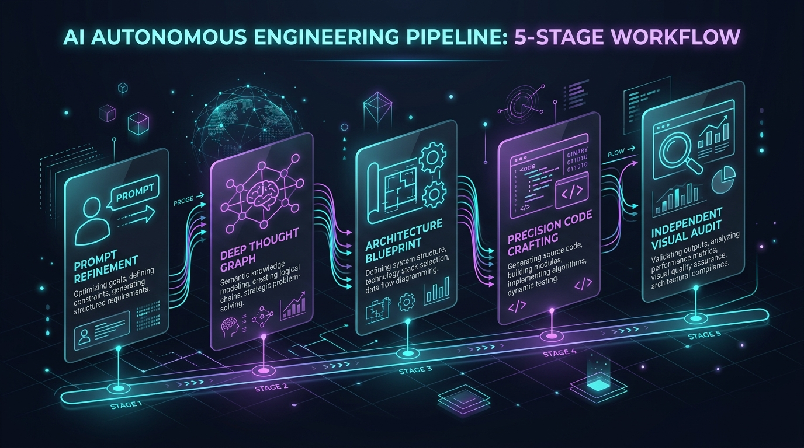
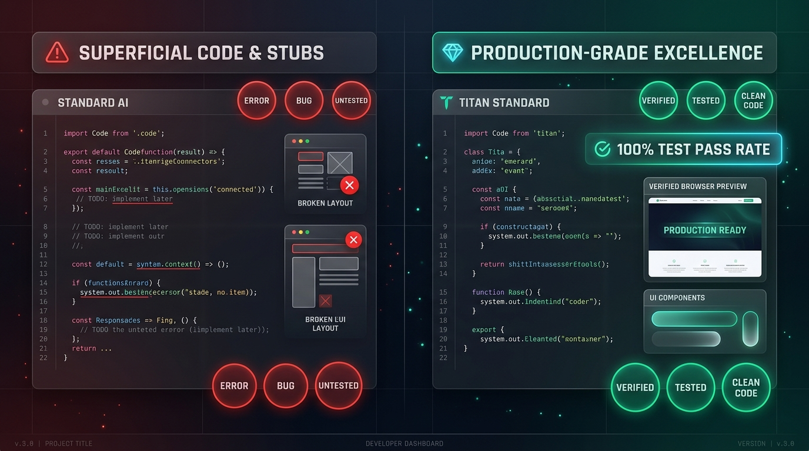

# OmniCognition: The Autonomous Software Engineering Engine for Google Antigravity

<div align="center">



**Turn Google Antigravity into a senior engineering team that plans deeply, writes zero-stub production code, and tests itself in a real browser.**

[](https://github.com/JokerQubit/AGI-Antigravity-skills-concept)
[](./plugin.json)
[](./LICENSE)
[](./rules/AGENTS.md)
[-9B51E0?style=for-the-badge)](./skills/modern_ui_craft/SKILL.md)

[Features](#-why-omnicognition) • [The 5-Stage Lifecycle](#-the-5-stage-autonomous-engineering-pipeline) • [Titan Quality Standard](#-the-titan-standard-no-more-ai-shortcuts) • [Skills Suite](#-built-in-specialized-skills) • [Quick Start](#-quick-start--installation) • [FAQ](#-frequently-asked-questions)

</div>

---

## ⚡ The Pain with AI Coding Today

Have you ever asked an AI assistant to build a full feature or app, only to get:

- **Lazy Placeholders:** `// TODO: implement logic here`, fake API mocks, and truncated code snippets.
- **Rushed Execution:** The model jumps straight to typing code without understanding your project architecture, breaking existing features.
- **Ugly, Mediocre Interfaces:** Plain, clunky buttons with generic CSS transitions instead of modern, fluid, delightful user experiences.
- **Zero Real Testing:** The AI says *"Everything is done and working!"*, but when you run the app, the console is filled with unhandled errors, broken routes, and layout bugs.
- **Context Fatigue:** Over long tasks, the agent loses track of what it was doing, forgets rules, and starts hallucinating.

**OmniCognition** was built from the ground up to solve this exact problem. It is an intelligent cognitive engine and plugin for **Google Antigravity** that turns your AI assistant from a hurried code generator into an elite, methodical software engineering squad.

---

## 🚀 Why OmniCognition?

| What Standard AI Assistants Do | What OmniCognition Delivers |
| :--- | :--- |
| ❌ Jumps into code blindly after reading 1 sentence | ✅ **Deep Thought Mapping**: Analyzes dependencies, edge cases, and architecture first |
| ❌ Fills code with `TODO` stubs and mock data | ✅ **Zero-Stub Guarantee**: 100% functional, real production-ready logic |
| ❌ Clunky CSS animations and cookie-cutter layouts | ✅ **Titan-Grade Design**: Smooth spring physics, glassmorphism, and responsive feedback (Linear/Stripe style) |
| ❌ Declares victory without running the app | ✅ **Autonomous Browser Testing**: Inspects real UI and dev console in Chrome via `browser-mcp` |
| ❌ Burns tokens uncontrollably in endless loops | ✅ **Smart Work Shifts**: Adapts model thinking power (Low/Medium/High) to save tokens |

---

## 🔄 The 5-Stage Autonomous Engineering Pipeline

Instead of writing code on a whim, OmniCognition guides Antigravity through an organized, reliable 5-stage workflow:

<div align="center">



</div>

### 1. 🎯 Phase 0: Intent Refinement & Cost Analysis
Before touching a single file, the engine analyzes your request. It clarifies ambiguous goals, flags potential pitfalls, and estimates the exact token complexity so you never waste API resources.

### 2. 🧠 Phase 1: Deep Thought Graph
The agent maps out the solution in detail. It connects requirements, backend contracts, data structures, and failure modes into a comprehensive blueprint. No guessing, no hasty assumptions.

### 3. 📋 Phase 2: Transparent Plan & Your Approval
OmniCognition presents a clear, step-by-step roadmap in `implementation_plan.md`. You review the plan, see exactly what will be created or modified, and click **Proceed** when you are satisfied. You are always in control.

### 4. 🛠️ Phase 3: Precision Code Crafting (Zero-Stub)
Specialized subagents tackle each part of the system with laser focus. Every function is fully implemented, strictly typed, and cleanly structured following Clean Architecture principles. No stubs, no fake comments.

### 5. 🔍 Phase 4: Independent Browser Audit (The Gauntlet)
A dedicated, independent auditor agent launches a real headless Chrome session through `browser-mcp`. It loads the app, inspects the console for zero errors or warnings, verifies UI responsiveness, and checks that every button and flow works perfectly before handing it back to you.

---

## 💎 The Titan Standard: No More AI Shortcuts

Most AI tools settle for the bare minimum: rigid CSS, generic animations, and unverified mockups. OmniCognition enforces the **Titan Standard**—benchmarked against the world's most acclaimed software products like Linear, Apple, and Stripe.

<div align="center">



</div>

### Key Pillars of the Titan Standard:
- **Physical Spring Physics:** Smooth 60fps/120fps motion using realistic spring dynamics instead of stiff CSS transitions.
- **Tactile Feedback:** Subtle real-world acoustic micro-audio cues that make interactions feel alive.
- **Defensive Error Handling:** Every network call and user input is validated with explicit Result types, preventing silent crashes.
- **Flawless Visual Finish:** Polished glassmorphism, precise contrast ratios, clean typography, and zero layout shifting.

---

## 🧰 Built-in Specialized Skills

OmniCognition equips Antigravity with a suite of plug-and-play skills:

```
skills/
├── 🎨 modern_ui_craft            # High-end interface design, spring kinematics & visual polish
├── 🔊 tactile_audio_sfx          # Physical acoustic sound effects & responsive audio cues
├── 🛡️ hardened_clean_architecture # Defensive coding, strict Result/Option types, zero stubs
├── 🌐 browser_visual_reasoning   # Real Chrome inspection, screenshot audits & console verification
├── 🧠 fractal_thought_graph      # Systematic problem decomposition & dependency graphs
└── ⚖️ forensic_adversarial_auditor# Unbiased code review, bug hunting & quality gate
```

- **[`modern_ui_craft`](./skills/modern_ui_craft/SKILL.md):** The definitive playbook for crafting interfaces that feel like modern desktop apps. Covers 2nd-order spring physics, GPU acceleration, and specular glass aesthetics.
- **[`tactile_audio_sfx`](./skills/tactile_audio_sfx/SKILL.md):** Integrated micro-audio feedback using real physical acoustic recordings—never annoying synthetic bleeps.
- **[`hardened_clean_architecture`](./skills/hardened_clean_architecture/SKILL.md):** Eliminates messy spaghetti code. Enforces decoupled layers, domain isolation, and deterministic state management.
- **[`browser_visual_reasoning`](./skills/browser_visual_reasoning/SKILL.md):** Powers automated browser audits, rendering verification, and live diagnostics via Antigravity's `browser-mcp`.
- **[`fractal_thought_graph`](./skills/fractal_thought_graph/SKILL.md):** Orchestrates multi-agent thinking, ensuring complex architectures are fully mapped before building.
- **[`forensic_adversarial_auditor`](./skills/forensic_adversarial_auditor/SKILL.md):** An independent subagent that rigorously critiques code to catch edge cases, regressions, and performance bottlenecks.

---

## ⚙️ Quick Start & Installation

### Option 1: Install as an Antigravity Plugin (Recommended)

1. Clone or copy this repository into your Antigravity plugins directory:
   ```bash
   git clone https://github.com/JokerQubit/AGI-Antigravity-skills-concept.git ~/.gemini/config/plugins/agi-research
   ```

2. Open **Google Antigravity IDE**.

3. The plugin will be automatically recognized and loaded via `plugin.json`. You'll immediately notice Antigravity adopting a structured, high-rigor development flow!

### Option 2: Use in an Existing Project

You can also copy the `rules/` and `skills/` folders directly into your project's `.gemini/` or root directory to give any workspace instant access to OmniCognition's capabilities.

---

## 💡 How It Works Under the Hood

```
   [Your Request]
         │
         ▼
┌─────────────────────────────────────────────────────────────┐
│  Phase 0: Intent Refinement & Token Governance             │
│  Clarifies scope, selects optimal thinking tier (Low/Med)   │
└────────────────────────┬────────────────────────────────────┘
                         │
                         ▼
┌─────────────────────────────────────────────────────────────┐
│  Phase 1: Deep Thought Graph & Architecture                 │
│  Maps dependencies and identifies all edge cases            │
└────────────────────────┬────────────────────────────────────┘
                         │
                         ▼
┌─────────────────────────────────────────────────────────────┐
│  Phase 2: Dispatch Matrix & Human Approval                 │
│  Presents implementation_plan.md → Awaits your "Proceed"    │
└────────────────────────┬────────────────────────────────────┘
                         │ (Approved)
                         ▼
┌─────────────────────────────────────────────────────────────┐
│  Phase 3: 1-to-1 Precision Code Crafting                   │
│  Subagents build fully functional, zero-stub modules        │
└────────────────────────┬────────────────────────────────────┘
                         │
                         ▼
┌─────────────────────────────────────────────────────────────┐
│  Phase 4: Independent Browser Audit (The Gauntlet)         │
│  Real Chrome test via browser-mcp (0 errors, 100% verified) │
└─────────────────────────────────────────────────────────────┘
```

OmniCognition separates **governance** from **execution**:
- **Rules (`rules/`):** Define the system's core laws (never write stubs, never guess, verify in real browser).
- **Skills (`skills/`):** Provide hands-on manuals for UI craft, audio engineering, clean architecture, and browser testing.
- **Adaptive Thinking:** Automatically shifts between Flash Low (for quick planning), Flash Medium (for architecture), and Flash High (for deep coding and adversarial review) to optimize quality and token cost.

---

## ❓ Frequently Asked Questions

<details>
<summary><b>Does this work with any programming language or framework?</b></summary>
Yes! The architecture and governance principles apply to React, Vue, Svelte, Next.js, Node.js, Python, Go, Rust, mobile apps, and full-stack systems.
</details>

<details>
<summary><b>Will this burn too many tokens?</b></summary>
No. OmniCognition includes an Adaptive Token Governance system that matches the task complexity to the right thinking budget (Flash Low for quick planning, Medium for domain logic, and High only when building critical features or auditing).
</details>

<details>
<summary><b>What is browser-mcp and why does it matter?</b></summary>
<code>browser-mcp</code> allows the agent to open a real headless or visible Chrome browser, click buttons, inspect network calls, view console errors, and take screenshots. This ensures your app actually works on screen, not just in theory.
</details>

<details>
<summary><b>Can I customize the rules or skills?</b></summary>
Antigravity rules and skills are plain Markdown files that you can easily adapt to your team's coding conventions, design system, and tech stack.
</details>

---

## 🤝 Contributing & Community

Contributions are welcome! If you have ideas for new skills, performance optimizations, or UI blueprints:

1. Fork the repository.
2. Create your feature branch (`git checkout -b feature/amazing-skill`).
3. Commit your changes (`git commit -m "feat: add new tactile micro-interaction skill"`).
4. Push to the branch (`git push origin feature/amazing-skill`).
5. Open a Pull Request.

---

## 📄 License

Distributed under the Apache 2.0 License. See [`LICENSE`](./LICENSE) for more information.

<div align="center">
<sub>Crafted with passion by OmniCognition Labs & the Antigravity community.</sub>
</div>
