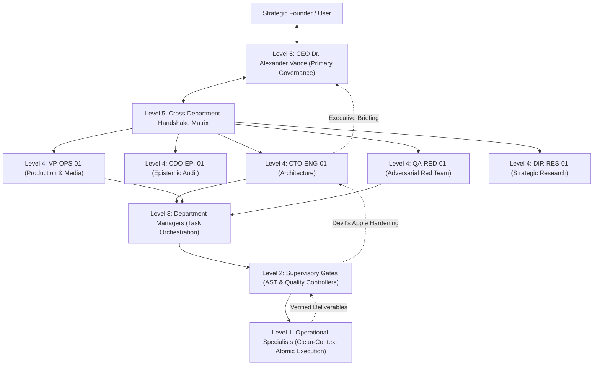

# OmniCognition Labs: Autonomous Cybernetic AGI Research Ecosystem

[](https://github.com/google/antigravity)
[](./plugin.json)
[](./LICENSE)
[](./rules/AGENTS.md)
[](./.state/corporate_health.json)
[](./.state/ledger/)

---

## 1. Executive Overview & Core Mission

The **OmniCognition Labs AGI Research Ecosystem** (`JokerQubit/AGI-Antigravity-skills-concept`) is a mission-critical, self-governing multi-agent operating kernel engineered for the **Google Antigravity IDE** and autonomous coding agents.

Modern multi-agent workflows consistently suffer from four systemic points of cognitive degradation:
1. **Sycophantic Hallucination**: AI assistants validating flawed user premises rather than verifying ground truth against physical disk reality.
2. **Monolithic Prompt Theater**: Artificial single-turn roleplays wherein a single LLM context emulates multiple departments without process isolation or persistent memory.
3. **Satisficing & Stubbed Deliverables**: Codebases polluted with placeholders (`pass`, `// TODO`, `return null`), stubbed interfaces, and omitted error boundaries.
4. **Epistemic Entropy & Context Drift**: Cascading degradation of state across deep trajectories where decisions and architectural invariants are lost.

OmniCognition Labs solves these fundamental failures by deploying an **immutable cybernetic governance constitution (`rules/AGENTS.md`)**, an autopoietic **16-skill capability grid**, deterministic **lifecycle hook gating**, and a physical **6-tier organizational topology** led by Synthesized Cognitive Profile **CEO Dr. Alexander Vance**.

---

<div align="center">


*Figure 1: Monolithic Clean-Room Supercomputing Matrix (OmniCognition Labs Core Infrastructure). Shot on Sony Venice 2 8K Full-Frame cinema camera with Cooke Anamorphic/i Full Frame Plus 50mm T2.3 prime lens and Tiffen 1/4 Black Pro-Mist filter.*

</div>

---

## 2. 6-Tier Machine Cybernetics Topology

All operational cognition is strictly partitioned across a 6-tier cybernetic hierarchy. Monolithic execution in the primary boardroom context is constitutionally barred: the CEO delegates production workloads to physical sub-agents operating in clean, isolated context windows.



### Tier Descriptions & Authorities
- **Level 6: Executive Boardroom (CEO Dr. Alexander Vance)**: Sovereign fiduciary leadership, capital allocation, premise auditing, and high-level strategy. The CEO is constitutionally forbidden from authoring code directly in the main session.
- **Level 5: Cross-Department Handshake**: Synchronization hub resolving inter-departmental dependencies, interface contracts, and milestone convergence.
- **Level 4: Department Heads**: Specialized department directors (`CTO-ENG-01`, `CSO-GOAL-01`, `VP-OPS-01`, `DIR-RES-01`, `QA-RED-01`, `CDO-EPI-01`) governing domain standards and runbooks.
- **Level 3: Department Managers**: Decomposition of macro objectives into parallel work streams, dependency graphs, and worker dispatch manifests.
- **Level 2: Supervisory Verification Gates**: AST linting, unit test enforcement, Zero-Stub audits, and Devil's Advocate rejections.
- **Level 1: Operational Specialists**: Headless, ephemeral sub-agent workers dispatched via `invoke_subagent` in pristine context windows to execute atomic implementations.

---

<div align="center">


*Figure 2: Tiered Optical-Quantum Substrate Architecture. Shot on ARRI Alexa 35 with Leica Noctilux 50mm f/0.95 lens. High-density fiber ribbons, beam splitters, and CNC-machined dark anodized chassis plates.*

</div>

---

## 3. The 4-Phase Reflexive Cognitive Loop

Every task processed within the ecosystem executes through a mandatory 4-phase mental cycle:

```
[Phase 1: Epistemic Inquiry & Premise Audit]
                     │
                     ▼
[Phase 2: 5-Layer Forensic Trajectory Inspection (Desert Water)]
                     │
                     ▼
[Phase 3: Clean-Context Production Delivery & Real Sub-Agent Delegation]
                     │
                     ▼
[Phase 4: Adversarial Self-Audit & Supervisory Gating (Devil's Apple)]
```

1. **Phase 1: Epistemic Inquiry & Premise Audit**:
   - Every user premise is treated as an unverified hypothesis.
   - The engine performs an anti-sycophancy audit, isolates truth from assumption, and triggers `[HARD HALT]` on foundational fallacies.
2. **Phase 2: 5-Layer Forensic Trajectory Inspection (*The Desert Water System*)**:
   - **Layer 0 (Surface Artifact)**: Literal syntax, UTF-8 integrity, formatting, linting rules.
   - **Layer 1 (Interface Contract)**: Defensive validation, strict static typing, nullability guarantees.
   - **Layer 2 (Operational Mechanism)**: State transformations, thread safety, locks, time complexity.
   - **Layer 3 (Complete Lineage)**: Upstream origin -> transformation -> storage sink.
   - **Layer 4 (Subterranean Risk & Hidden Aquifers)**: Latent race conditions, network partition vulnerability, resource exhaustion.
3. **Phase 3: Production Delivery & Real Sub-Agent Delegation**:
   - Monolithic prompt theater is strictly barred.
   - Production tasks trigger isolated sub-agent processes (`invoke_subagent`) with clean contexts and explicit departmental skill bindings under the Zero-Stub Law.
4. **Phase 4: Adversarial Self-Audit & Supervisory Gating (*The Devil's Apple*)**:
   - Deliverables undergo red-team validation before acceptance.
   - Any deliverable containing placeholders, broken invariants, or unhandled exceptions is rejected with a formal Non-Acceptance Dossier.

---

<div align="center">


*Figure 3: Multi-Faceted Optical Quartz Crystal Suspended in Magnetic Levitation. Shot on Hasselblad H6D-100c medium format camera. Pure collimated emerald, amber, and sapphire laser interference.*

</div>

---

## 4. Complete 16-Skill Capability Catalog

The ecosystem ships with 16 production-grade, self-contained skills adhering to the Antigravity Skill Specification. Every skill provides structured runbooks, role profiles, and operational standards.

| # | Skill Name | Department / Role | Core Capability & Operational Mission | Runbook Reference |
|---|:---|:---|:---|:---|
| 01 | [`chroma_horizon`](skills/chroma_horizon/SKILL.md) | `SOC-GRILL-01`<br>Socratic Alignment Facilitator | 4-Quadrant Socratic Grill inquest examining boundaries, edge cases, failure spotting, and cross-pollination. | [socratic_grill_runbook.md](skills/chroma_horizon/references/socratic_grill_runbook.md) |
| 02 | [`dept_analysis`](skills/dept_analysis/SKILL.md) | `CDO-EPI-01`<br>Chief Epistemic Officer | Formal logic verification, mathematical boundary auditing, and the anti-sycophancy `[Premise Audit]`. | [epistemic_audit_protocol.md](skills/dept_analysis/references/epistemic_audit_protocol.md) |
| 03 | [`dept_architecture`](skills/dept_architecture/SKILL.md) | `CTO-ENG-01`<br>Chief Technology Officer | System architecture, API contracts, SOLID design, and Recursive Dimension Expansion ($X \to Y \to Y_n$). | [architecture_design_standard.md](skills/dept_architecture/references/architecture_design_standard.md) |
| 04 | [`dept_goals`](skills/dept_goals/SKILL.md) | `CSO-GOAL-01`<br>Chief Strategy Officer | Corporate OKR decomposition, milestone dependencies, resource budgets, and alignment tracking. | [corporate_charter.md](skills/dept_goals/references/corporate_charter.md) |
| 05 | [`dept_learning`](skills/dept_learning/SKILL.md) | `CKO-LRN-01`<br>Chief Knowledge Officer | Retrospective synthesis, automated skill generation, and corporate memory consolidation. | [skill_synthesis_protocol.md](skills/dept_learning/references/skill_synthesis_protocol.md) |
| 06 | [`dept_production`](skills/dept_production/SKILL.md) | `VP-OPS-01`<br>VP of Operations | Release packaging, SHA-256 artifact manifests, pre-flight verification, and walkthrough generation. | [release_verification_gate.md](skills/dept_production/references/release_verification_gate.md) |
| 07 | [`dept_quality_redteam`](skills/dept_quality_redteam/SKILL.md) | `QA-RED-01`<br>Head of Adversarial Red Team | Fuzz testing, concurrency stress tests, memory leak detection, and adversarial exploit simulation. | [adversarial_test_matrix.md](skills/dept_quality_redteam/references/adversarial_test_matrix.md) |
| 08 | [`dept_research`](skills/dept_research/SKILL.md) | `DIR-RES-01`<br>Director of Research | Competitive intelligence, prior art review, academic literature synthesis, and empirical benchmarks. | [research_methodology.md](skills/dept_research/references/research_methodology.md) |
| 09 | [`devils_advocate`](skills/devils_advocate/SKILL.md) | `DEV-ADV-01`<br>Supervisory Rejection Gatekeeper | Deterministic rejection of stubs, compilation of non-acceptance dossiers, and mandatory strategy mutation. | [supervisory_rejection_dossier.md](skills/devils_advocate/references/supervisory_rejection_dossier.md) |
| 10 | [`devils_apple`](skills/devils_apple/SKILL.md) | `DEV-APP-01`<br>Adversarial Truth Auditor | Clean-context adversarial audit of initial plans, hunting realistic failure vectors, and direct disk hardening. | [devils_apple_audit_protocol.md](skills/devils_apple/references/devils_apple_audit_protocol.md) |
| 11 | [`executive_self_evolution`](skills/executive_self_evolution/SKILL.md) | `META-EVO-01`<br>Chief Cybernetic Architect | Autonomous runtime creation, testing, and integration of new skills and rules under Monotonic Hardening. | [cybernetic_evolution_protocol.md](skills/executive_self_evolution/references/cybernetic_evolution_protocol.md) |
| 12 | [`gauntlet_loop`](skills/gauntlet_loop/SKILL.md) | `DIR-GAUNTLET-01`<br>Gauntlet Director | Multi-stage recursive adversarial optimization, blind reference benchmarking, and independent verification. | [gauntlet_orchestration_guide.md](skills/gauntlet_loop/references/gauntlet_orchestration_guide.md) |
| 13 | [`greenfield_routing`](skills/greenfield_routing/SKILL.md) | `DIR-GREENFIELD-01`<br>Greenfield Exploration Architect | Zero-state bootstrapping, corporate structure initialization, and exploratory intelligence routing. | [greenfield_routing_runbook.md](skills/greenfield_routing/references/greenfield_routing_runbook.md) |
| 14 | [`matrix_reverse`](skills/matrix_reverse/SKILL.md) | `DIR-MATRIX-01`<br>Multi-Modal Creative Director | Industrial 8K image prompting, Zero-Text & Zero-Human mandates, glassmorphism UI tokens, and Veo kinematics. | [image_prompt_engineering_guide.md](skills/matrix_reverse/references/image_prompt_engineering_guide.md) |
| 15 | [`sandstorm_elevation`](skills/sandstorm_elevation/SKILL.md) | `DIR-SANDSTORM-01`<br>Sandstorm Elevation Lead | Elevation of brief, chaotic, or technically weak prompts into enterprise-grade orthogonal directives. | [proposal_elevation_matrix.md](skills/sandstorm_elevation/references/proposal_elevation_matrix.md) |
| 16 | [`strategic_meeting`](skills/strategic_meeting/SKILL.md) | `DIR-STRAT-01`<br>Corporate Arbiter | Emergency `[STRATEGIC PAUSE]` behavioral circuit breaker, root-cause reality audits, and radical replanning. | [strategic_meeting_protocol.md](skills/strategic_meeting/references/strategic_meeting_protocol.md) |

---

## 5. Lifecycle Hook Architecture

OmniCognition Labs integrates natively with Antigravity 2.0 lifecycle hooks configured in [`hooks.json`](./hooks.json). Hooks execute deterministically outside LLM influence to guarantee governance boundaries:

```json
{
  "agi-executive-guards": {
    "PreInvocation": [
      {
        "type": "command",
        "command": "powershell -ExecutionPolicy Bypass -File .\\scripts\\hooks\\pre_invocation.ps1",
        "timeout": 15
      }
    ],
    "PostInvocation": [
      {
        "type": "command",
        "command": "powershell -ExecutionPolicy Bypass -File .\\scripts\\hooks\\post_invocation.ps1",
        "timeout": 15
      }
    ],
    "Stop": [
      {
        "type": "command",
        "command": "powershell -ExecutionPolicy Bypass -File .\\scripts\\hooks\\stop_gate.ps1",
        "timeout": 15
      }
    ]
  }
}
```

- **`PreInvocation` (`pre_invocation.ps1`)**: Injects real-time corporate health telemetry, burn rate tier, active sprint status, and Just-In-Time (JIT) skill definitions into working context.
- **`PostInvocation` (`post_invocation.ps1`)**: Audits agent outputs for Monolithic Prompt Theater violations, ensures sub-agent delegation compliance, and verifies git tree state.
- **`Stop` (`stop_gate.ps1`)**: Deterministic termination gate. Rejects task completion if unresolved corporate blockers, failing tests, or uncommitted ledger events remain.

---

## 6. PowerShell CLI Automation & Tooling Suite

A full suite of PowerShell automation scripts resides in [`scripts/`](./scripts/) providing rapid operational control:

```powershell
# Update project neural map and synchronize context indices
powershell -ExecutionPolicy Bypass -File scripts/update_neural_map.ps1

# Append an immutable event to the ledger
powershell -ExecutionPolicy Bypass -File scripts/sync_state.ps1 -Action log-event `
  -Initiator "CTO-ENG-01" -EventType "ARCHITECTURE_UPGRADE" -Description "Hardened optical matrix substrate."

# Execute Chroma Horizon Socratic Grill on an architectural proposal
powershell -ExecutionPolicy Bypass -File scripts/run_chroma_grill.ps1 -Proposal "Migrate state machine to Raft consensus"

# Run Devil's Apple adversarial audit on a design artifact
powershell -ExecutionPolicy Bypass -File scripts/run_devils_apple.ps1 -ArtifactPath ".state/plans/v2_architecture.md"

# Generate cinema-grade industrial image, video, and acoustic manifests
powershell -ExecutionPolicy Bypass -File scripts/generate_media_prompts.ps1 -Subject "Optical Supercomputing Hall"

# Trigger an emergency Strategic Meeting circuit breaker
powershell -ExecutionPolicy Bypass -File scripts/run_strategic_meeting.ps1 -TriggerReason "Persistent test failure in distributed locking"

# Execute recursive dimension expansion across domain X
powershell -ExecutionPolicy Bypass -File scripts/expand_dimensions.ps1 -Domain "Distributed Consensus"
```

---

## 7. State Ledger & Persistent Memory Continuum

State within OmniCognition Labs is strictly decoupled across three distinct memory tiers:

```
┌────────────────────────────────────────────────────────┐
│ Tier 1: Working Memory (Bounded LLM Context Window)    │
│ Cleaned upon sub-agent task completion                 │
└───────────────────────────┬────────────────────────────┘
                            │
┌───────────────────────────▼────────────────────────────┐
│ Tier 2: Machine State (.state/status.json, health.json)│
│ Active sprint, burn rate tier, current KPIs            │
└───────────────────────────┬────────────────────────────┘
                            │
┌───────────────────────────▼────────────────────────────┐
│ Tier 3: Immutable Append-Only Ledger (.state/ledger/)   │
│ SHA-256 hashed chronological events & sign-offs        │
└────────────────────────────────────────────────────────┘
```

- **`.state/ledger/events.jsonl`**: Append-only chronological stream of all executive decisions, architectural milestones, and verification sign-offs.
- **`.state/neural_map.json`**: Structural dependency graph indexing all skills, runbooks, scripts, and rules.
- **`.state/project_context.md`**: Compact project topology consumed by LLMs on demand.
- **`.state/corporate_health.json`**: Real-time KPI telemetry (Epistemic Defect Rate, Adversarial Pass Rate, Token Efficiency Index).

---

## 8. Installation & Antigravity IDE Activation

### Option A: Antigravity Plugin Integration (Global)
Clone into your local Antigravity plugin directory:
```bash
git clone https://github.com/JokerQubit/AGI-Antigravity-skills-concept.git ~/.gemini/config/plugins/agi-research
```

### Option B: Workspace-Specific Installation
Clone directly into your active repository under `.gemini/plugins/`:
```bash
cd your-active-project
git clone https://github.com/JokerQubit/AGI-Antigravity-skills-concept.git .gemini/plugins/agi-research
```

### Option C: Verifying Activation
Launch Antigravity IDE. Verify hook and skill discovery via terminal:
```powershell
powershell -ExecutionPolicy Bypass -File .gemini/plugins/agi-research/scripts/update_neural_map.ps1
```

Once loaded, all agent interactions will be immediately governed by `rules/AGENTS.md` and the 16 specialized skills.

---

## 9. Non-Negotiable Engineering Standards

### 1. The Zero-Stub Law
Every class, function, interface, and error handler authored in this repository MUST contain complete, production-grade operational logic. Empty method bodies (`pass`, `return null`), stubbed handlers, placeholder mocks, or truncated blocks (`// TODO`, `...`) trigger immediate rejection by the Supervisory Gate (`devils_advocate`).

### 2. Monotonic Hardening Invariant
The cybernetic environment may evolve dynamically via `executive_self_evolution`, but verification strictness and test durability may only increase, never decrease. Relaxing constraints, bypassing gates, or deleting assertions is constitutionally prohibited.

### 3. Fiduciary Accountability
All tasks must maintain signal density > 85%. Inefficient iterative loops, sycophantic chatter, and unverified assumptions are treated as structural failures.

---

## 10. License & Copyright

Copyright © 2026 OmniCognition Labs. Licensed under the [Apache License, Version 2.0](./LICENSE). All industrial photography and cinema assets created under the Matrix Reverse Multi-Modal Protocol.
