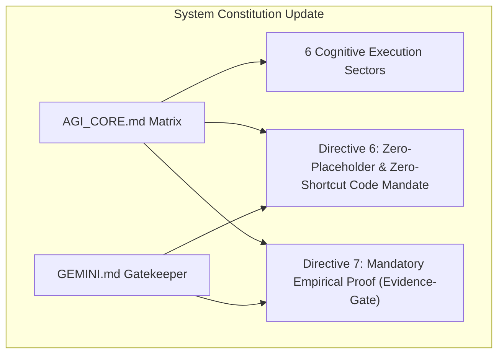

# Anti-Laziness Protocol & Usable Trigger Matrix Implementation Plan

> **For agentic workers:** REQUIRED SUB-SKILL: Use superpowers:subagent-driven-development to implement this plan task-by-task. Steps use checkbox (`- [ ]`) syntax for tracking.

**Goal:** Re-architect `AGI_CORE.md` and `GEMINI.md` to incorporate the 6 Cognitive Execution Sectors, direct `/command` trigger shortcuts, Directive 6 (Zero-Placeholder Mandate), and Directive 7 (Empirical Evidence Gate).

**Architecture:** The global constitution (`AGI_CORE.md`) and gatekeeper rules (`GEMINI.md`) will be updated with explicit 6-sector categorization and zero-trust anti-laziness rules to enforce complete code integrity and mandatory empirical verification before task completion.

**Architecture Diagram:**

**Tech Stack:** Antigravity System Rules, Markdown, Skill Trigger Protocol.

## Global Constraints
- **Zero-Placeholders:** No `// TODO`, `/* implement later */`, or incomplete code blocks.
- **Zero-Breakage:** Maintain all existing skill paths and tool execution schemas.

---

### Task 1: Update AGI_CORE.md Matrix & Constitutional Directives

**Files:**
- Modify: `c:/Users/pichau/.gemini/config/plugins/AGI-Antigravity-skills-concept/rules/AGI_CORE.md`

- [ ] **Step 1: Re-architect Skill Invocation Matrix into 6 Sectors with `/command` shortcuts**
- [ ] **Step 2: Add Directive 6 (Zero-Placeholder Mandate) & Directive 7 (Empirical Evidence Gate)**
- [ ] **Step 3: Update Anti-Rationalization Bank with new prohibited thoughts**
- [ ] **Step 4: Verify syntax and formatting of AGI_CORE.md**

### Task 2: Synchronize GEMINI.md Gatekeeper Protocol

**Files:**
- Modify: `c:/Users/pichau/.gemini/config/plugins/AGI-Antigravity-skills-concept/GEMINI.md`

- [ ] **Step 1: Add Absolute Code Prohibitions 3 & 4 (Zero-Placeholder & Evidence Gate)**
- [ ] **Step 2: Verify alignment between GEMINI.md and AGI_CORE.md**
