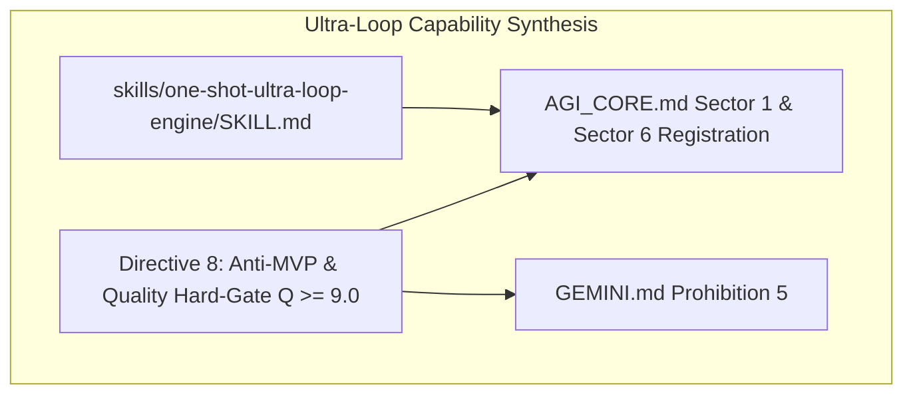

# Autonomous One-Shot Ultra-Loop Engine Implementation Plan

> **For agentic workers:** REQUIRED SUB-SKILL: Use superpowers:subagent-driven-development to implement this plan task-by-task. Steps use checkbox (`- [ ]`) syntax for tracking.

**Goal:** Implement the `one-shot-ultra-loop-engine` skill and update `AGI_CORE.md` & `GEMINI.md` to mandate the Anti-MVP Directive 8 and the Autonomous Quality Score ($Q \ge 9.0/10$).

**Architecture:** A new skill (`skills/one-shot-ultra-loop-engine/SKILL.md`) will govern one-shot prompt execution loops. `AGI_CORE.md` and `GEMINI.md` will receive Directive 8 (Prohibition of Shallow MVPs) and the $Q \ge 9.0$ Quality Hard-Gate.

**Architecture Diagram:**

**Tech Stack:** Antigravity Skill Engine, Markdown, System Constitution.

## Global Constraints
- **Zero-MVPs:** Prohibit shallow prototypes; mandate complete subsystem decomposition.
- **Hard-Gate:** $Q \ge 9.0/10$ required before ending turn on one-shot requests.

---

### Task 1: Synthesize `one-shot-ultra-loop-engine` Skill

**Files:**
- Create: `c:/Users/pichau/.gemini/config/plugins/AGI-Antigravity-skills-concept/skills/one-shot-ultra-loop-engine/SKILL.md`

- [ ] **Step 1: Draft SKILL.md with 5-Phase Deep Execution Workflow**
- [ ] **Step 2: Include Autonomous Quality Matrix ($Q \ge 9.0/10$) calculation logic**
- [ ] **Step 3: Include anti-MVP enforcement directives**

### Task 2: Update AGI_CORE.md & GEMINI.md Directives

**Files:**
- Modify: `c:/Users/pichau/.gemini/config/plugins/AGI-Antigravity-skills-concept/rules/AGI_CORE.md`
- Modify: `c:/Users/pichau/.gemini/config/plugins/AGI-Antigravity-skills-concept/GEMINI.md`

- [ ] **Step 1: Register `one-shot-ultra-loop-engine` in Sector 1 & Sector 6 of AGI_CORE.md**
- [ ] **Step 2: Add Directive 8 (Anti-MVP & Quality Hard-Gate $Q \ge 9.0$) to AGI_CORE.md**
- [ ] **Step 3: Add Prohibition 5 (Anti-MVP & Quality Gate) to GEMINI.md**
- [ ] **Step 4: Update session_state.md inventory to 27 active skills**
