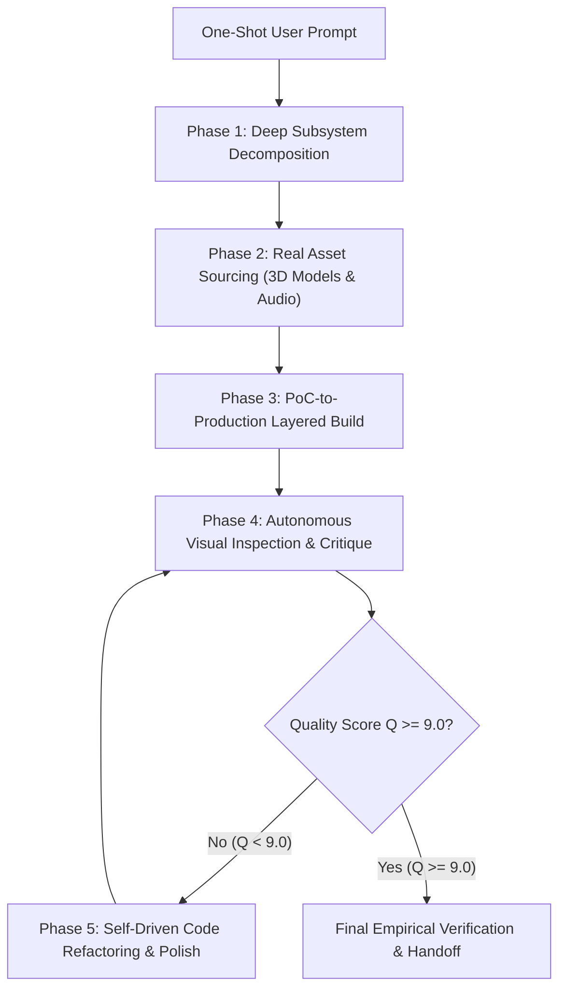

# Design Spec: Autonomous One-Shot Ultra-Loop Engine & Deep Quality Protocol (Epoch 2.2)

## Executive Summary
This design specification addresses the core limitation of conversational LLM agents: the tendency to deliver shallow, 10-minute MVPs or basic prototypes when given a broad one-shot prompt (e.g., "Build a 3D racing game" or "Build a full e-commerce platform"). 

The **One-Shot Ultra-Loop Engine** forces the system to automatically decompose prompts into production-grade multi-subsystem specifications, prohibit shallow MVPs, and autonomously execute recursive quality refinement loops until achieving an empirical **Quality Score ($Q \ge 9.0/10$)** before ending the turn.

---

## 1. Anti-MVP Constitutional Directives

### 🛡️ Directive 8: Prohibition of Shallow MVPs & Mandatory Subsystem Decomposition
1. **Shallow MVP Prohibition:** The agent is strictly forbidden from delivering simple prototypes, wireframes, or single-file demonstrations when a comprehensive system or game is requested.
2. **Mandatory Deep Subsystem Mapping:** For any application or game request, the initial plan MUST explicitly decompose and implement ALL necessary production subsystems:
   - **Visual Infrastructure:** PBR materials, HDRI lighting, dynamic shadows, post-processing (Bloom, Ambient Occlusion, Motion Blur).
   - **Real Asset Sourcing:** Sourcing real `.glb` models from Sketchfab via `sketchfab-prospecting-protocol` (zero primitive shapes).
   - **Real Audio Infrastructure:** Sourcing real `.mp3`/`.ogg` audio files from YouTube via `youtube-audio-prospecting` and `yt-dlp` (zero procedural synth beeps).
   - **Physics & Logic Engine:** Advanced collision detection, responsive controls, state management, particle effects.
   - **Full UI/UX System:** Glassmorphic HUD, navigation, pause menus, scoreboards, responsive design.

---

## 2. Autonomous Quality Evaluation Matrix ($Q \ge 9.0/10$)

Before declaring any one-shot task completed, the agent must evaluate the system against the **Autonomous Quality Matrix**:

$$\text{Quality Score } Q = \frac{S_{\text{visual}} + S_{\text{logic}} + S_{\text{assets}} + S_{\text{audio}} + S_{\text{ui}}}{5}$$

| Metric | Score = 2.0 (Failed / Shallow) | Score = 10.0 (AAA State-of-the-Art) |
|---|---|---|
| **$S_{\text{visual}}$ (Visual Fidelity)** | Basic flat colors, default canvas | PBR lighting, Bloom, post-processing, glassmorphism |
| **$S_{\text{logic}}$ (Logic/Physics)** | Simple 2-line movement, no bounds | Full collision detection, particle physics, state management |
| **$S_{\text{assets}}$ (3D/Media)** | Primitive cubes/spheres | High-fidelity GLTF 3D models downloaded from Sketchfab |
| **$S_{\text{audio}}$ (Audio)** | Silent or OscillatorNode beeps | Multi-channel real sound effects (engine, wind, music) |
| **$S_{\text{ui}}$ (UI/UX)** | Plain unstyled HTML buttons | Polished Glassmorphism HUD, responsive layouts |

> 🔴 **HARD-GATE:** If $Q < 9.0$, the agent is strictly forbidden from ending its turn. It must immediately execute an internal refactoring iteration.

---

## 3. The Autonomous Ultra-Loop Execution Workflow

---

## 4. New Skill Definition: `one-shot-ultra-loop-engine`
- **Location:** `skills/one-shot-ultra-loop-engine/SKILL.md`
- **Sector Mapping:** Sector 1 (Genesis) & Sector 6 (Continuous Evolution)
- **Role:** Autonomous driver that intercepts complex one-shot prompts and sequences multi-iteration deep execution without stopping for micro-approvals.
