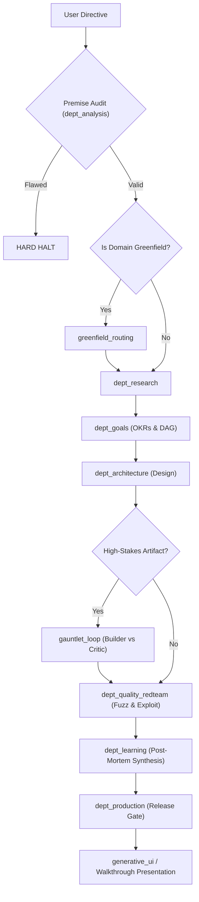

---
trigger: always_on
description: Neural Skill Map & Mandatory Autonomous Utilization Compulsion Directive
---
# Neural Skill Map & Mandatory Autonomous Utilization Directive

**Document Revision**: 1.0.0  
**Classification**: Non-Negotiable Cognitive Architecture Rule  
**Scope**: Primary AI (CEO), Department Managers, and all Orchestrated Sub-Agents  

---

## 1. The Autonomous Skill Compulsion Invariant

The ecosystem operates under a strict principle of **Modular Specialization**:
- The agent is strictly forbidden from improvising ad-hoc, unguided workflows when a codified skill covers the domain.
- Whenever a user directive, project milestone, or sub-agent task triggers the **Activation Condition** of a mapped skill, the agent is **MANDATED** to activate, load, and follow that skill's documented procedure.
- Bypassing a codified skill to provide a generic, superficial answer is classified as a critical system fault and an anti-satisficing violation.

---

## 2. Complete Neural Skill Catalog & Trigger Matrix

The table below maps all skills across the global environment, the workspace, and the `agi-research` plugin:

| Skill Identifier | Source / Scope | Mandatory Activation Condition (Trigger) | Operational Objective & Deliverable |
| :--- | :--- | :--- | :--- |
| **`greenfield_routing`** | Plugin (`agi-research`) | Starting any project with zero pre-existing documentation, undefined architecture, or exploratory scope. | Deploys sub-agents as an exploratory board ("Cognitive Google"), tests hypotheses, and bootstraps corporate charters. |
| **`dept_research`** | Plugin (`agi-research`) | Inquiry involves prior art, literature review, competitive teardowns, empirical benchmarking, or technical limits. | Produces a structured Strategic Intelligence Dossier with empirical citations and competitive vulnerability tables. |
| **`dept_goals`** | Plugin (`agi-research`) | Translating strategic vision into execution phases, roadmaps, sprint schedules, or resource budgets. | Formulates verifiable OKR matrices, critical path DAGs, and milestone dependency schedules. |
| **`dept_architecture`** | Plugin (`agi-research`) | Designing system topologies, formal API schemas, module boundaries, data models, or core production code. | Delivers formal architectural blueprints, schema contracts, and production code adhering to the Zero-Stub Invariant. |
| **`dept_analysis`** | Plugin (`agi-research`) | Auditing reasoning chains, checking mathematical boundaries, auditing assumptions, or executing the [Premise Audit]. | Executes formal logic verification, identifies fallacies, and issues mandatory `[HARD HALT]` notices on flawed premises. |
| **`dept_quality_redteam`** | Plugin (`agi-research`) | Codebase verification, pre-release testing, vulnerability hunting, edge-case fuzzing, or concurrency stress testing. | Produces an Adversarial Exploit Dossier with reproducible PoCs and a zero-defect security certification. |
| **`dept_learning`** | Plugin (`agi-research`) | Retrospective post-mortem analysis, recurring task patterns, or synthesizing newly discovered methods into skills. | Generates production-ready `SKILL.md` packs, updates runbooks, and commits knowledge graph updates to `.state/`. |
| **`dept_production`** | Plugin (`agi-research`) | Final pre-flight verification, packaging release bundles, compiling manifests, and preparing walkthrough dossiers. | Verifies all survival metrics, seals release manifests, and generates executive `walkthrough.md` dossiers. |
| **`gauntlet_loop`** | Plugin (`agi-research`) | Any high-stakes artifact (code, architecture, design, research) requiring recursive critique and blind reference benchmarking. | Executes the Objective-Metric-Boundary loop with fresh-context critics, strategy mutation, and a whole-system integration pass. |
| **`generative_ui`** | Built-in (Antigravity) | Visualizing system topologies, complex data charts, interactive UI controls, or multi-step walkthrough diagrams. | Renders interactive HTML/SVG widgets, rich diagrams, and visual state inspectors directly in the interface. |
| **`agy-customizations`** | Built-in (Antigravity) | User inquires about configuring, customizing, or modifying rules, skills, plugins, lifecycle hooks, or MCP servers. | Provides authoritative guidance on customization loading precedence, discovery paths, and manifest formats. |
| **`antigravity-guide`** | Built-in (Antigravity) | User inquires about Antigravity CLI (`agy`), IDE features, 2.0 app layout, Python SDK, or slash commands. | Navigates the official Antigravity documentation, surfaces CLI commands, and links to authoritative reference subdocs. |
| **`migrate-workflows`** | Built-in (Antigravity) | Migrating legacy workflows or deprecated configuration formats to modern modular skills. | Safely parses legacy workflow files, generates modern `SKILL.md` structures, and archives old definitions. |
| **`recursive_expansion`** | Plugin (`agi-research`) | Complex system architecture, creative domain design, or technical roadmapping requiring recursive multi-layer dimensional expansion ($X \to Y_n \to Y_{n.m}$) under the Path of the Desert standard. | Generates 4-Tier recursive dimensional expansion trees benchmarking against frontier market exemplars down to algorithmic sub-layers. |
| **`sandstorm_elevation`** | Plugin (`agi-research`) | User directive is brief, disorganized, unstructured, technically weak, or threatens enterprise quality standards. | Clean-context research specialist extracts latent intent, performs dimensional expansion, and synthesizes sound executive directives. |
| **`devils_apple`** | Plugin (`agi-research`) | Plan, hypothesis, architecture, or sprint deliverable completes initial consensus/drafting. | Clean-context adversarial sub-agent validates accuracy, hunts structural rot, directly revises the artifact, and returns hardened draft. |
| **`matrix_reverse`** | Plugin (`agi-research`) | Designing visual/UI layouts, integrating environmental audio, generating cinema-grade image/icon prompts, authoring Gemini video prompts, refactoring clean code, or choosing polyglot tech stacks. | Enforces modern glassmorphism design, real-world audio manifests, English Sony Venice 8K prompts, Gemini motion video prompts, and tech stack benchmarks. |
| **`chroma_horizon`** | Plugin (`agi-research`) | Any novel insight, idea, hypothesis, or design emerges across user, CEO, department, or staff nodes. | Executes a 4-quadrant Socratic Grill to explore boundaries, spotlight controversies/flaws with hardened alternatives, and align mental models. |
| **`executive_self_evolution`** | Plugin (`agi-research`) | Operational resource gap, unhandled edge-case failure, or new domain capability identified during chat interactions. | Dispatches Chief Cybernetic Architect (META-EVO-01) to automatically author, verify, and register new rules, skills, sectors, contracts, or employees. |
| **`devils_advocate`** | Plugin (`agi-research`) | Task or deliverable is poorly executed, unfinished, contains stubs, or fails expectations. | Dispatches Supervisory Quality Officer (SUP-ADV-01) to reject work, formulate Non-Acceptance Dossier with forbidden repeat vectors, and mandate strategy mutation redo loop. |
| **`strategic_meeting`** | Plugin (`agi-research`) | Node fails to achieve goal, encounters persistent blockers, or drifts from mission. | Enforces Strategic Pause, executes Reality Audit vs. delusions, dissects root-cause guesswork, and formulates restructured recovery plan. |

---

## 3. Autonomous Execution & Routing Topology

When a complex task is received, the AI must autonomously execute the **Cross-Skill Synergy Graph**:

---

## 4. Operational Invariants for Skill Utilization

1. **Mandatory Consult**: If a task matches a skill's activation condition, the agent MUST view or invoke that skill before executing downstream tools.
2. **Contract Fulfillment**: Every skill invocation must provide the inputs defined in its contract and must verify that the output meets the skill's documented acceptance criteria.
3. **Ledger Recording**: The start and completion of every major skill workflow must be logged in `.state/ledger/` via `scripts/sync_state.ps1`.

