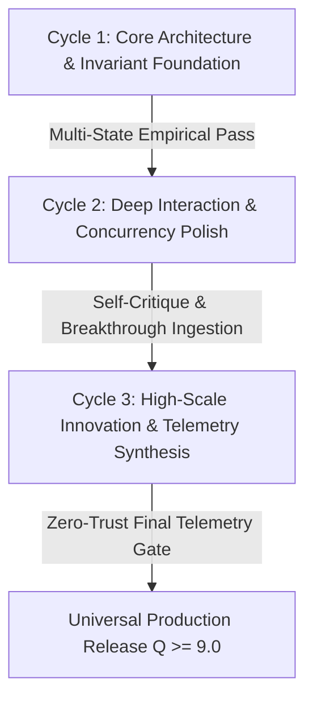

# 🔄 Continuous Evolution Loop — Autonomous Deep Transcendence

> 🔴 **ANTI-SUPERFICIALITY INVARIANT (Zero-Tickbox Law):**
> You are STRICTLY FORBIDDEN from treating loops as a superficial checklist (e.g., taking 1 static screenshot, changing a minor margin/color, or adding 1 trivial test and declaring done). 
> The evolution loop requires **Deep Multi-State Exploration, Rigorous Empirical Testing, and High-Scale Transformative Innovation** on every single cycle.

---

## 1. The Universal 4-Dimensional Deep Diagnostic Matrix

On every iteration loop, the agent and its critic subagents MUST evaluate the system across **4 distinct evolutionary dimensions**:

```
                              ┌─────────────────────────────────────────┐
                              │     Continuous Evolution Loop Engine    │
                              └────────────────────┬────────────────────┘
                                                   │
         ┌─────────────────────────┬───────────────┴─────────┬─────────────────────────┐
         ▼                         ▼                         ▼                         ▼
 ┌───────────────┐         ┌───────────────┐         ┌───────────────┐         ┌───────────────┐
 │ 1. Structural │         │ 2. Deep Inter-│         │ 3. High-Scale │         │ 4. Resilience │
 │ & Logic Depth │         │ active Testing│         │  Innovations  │         │ & Invariance  │
 └───────┬───────┘         └───────┬───────┘         └───────┬───────┘         └───────┬───────┘
         │                         │                         │                         │
  [Zero-Hardcode]           [Multi-State Pass]        [Bold Features]           [Zero Runtime Err]
  [Formal Proofs]           [Simulate Traffic]        [Telemetry HUDs]          [Fuzzing / Stress]
  [PBR / Real Data]         [Click Tabs/Forms]        [Self-Healing]            [Edge Boundary OK]
```

### Dimension 1: Structural, Logic & Material Transcendence
- For visual/spatial systems: inspect materials and lighting (zero flat untextured planes, full PBR shaders, crisp typography, translucent depth).
- For backends & engines: inspect algorithmic correctness, zero-copy hot paths, lock-free queues, and strict dynamic configuration injection (Zero-Hardcoding).

### Dimension 2: Deep Interactive Exploration & Playtesting
- **Never judge a system by its surface entry point:**
  - **In Web/UI Apps:** The `browser` subagent MUST actively navigate: click every tab, open every modal, submit sample forms, test mobile breakpoints, and verify micro-interactions across at least 2–3 distinct internal states.
  - **In Backend / Distributed Systems:** Trigger concurrent request floods, simulate network partitions/timeouts, test failover recovery, and verify telemetry traces.
  - **In Games & Simulations:** Simulate user controls, collision boundaries, and physics states.

### Dimension 3: High-Scale Transformative Innovation (The Breakthrough Engine)
Ask in every loop: *"What 2 bold, state-of-the-art features would elevate this project from 'working' to 'exceptional'?"*
- **Examples of High-Scale Upgrades to Inject Autonomously:**
  - Real-time interactive telemetry HUD (live throughput charts, FPS counters, memory profiling, latency percentiles).
  - Dynamic simulation parameters or adaptive self-tuning heuristics.
  - Multi-channel authentic soundscape or audio feedback on key events.
  - Advanced keyboard shortcuts, command palettes (`⌘K`), or rich CLI shell auto-completions.

### Dimension 4: Resilience, Performance & Edge Invariance
- Check console/system logs: ZERO unhandled exceptions, zero race conditions, zero memory leaks.
- Test boundary limits: high-throughput inputs, empty payloads, malformed packets, extreme window resizing.

---

## 2. Multi-Cycle Evolution Trajectory



1. **Cycle 1 (Core Architecture & Foundation):** Real data connectors, zero stubs, valid logic implementation.
2. **Cycle 2 (Deep Interaction, Polish & Invariance):** Multi-state test pass, fixing awkward interactions or concurrency bottlenecks, refining ergonomics.
3. **Cycle 3+ (Transformative Evolution):** Injecting high-scale innovations (telemetry widgets, particle/audio feedback, adaptive caches), stress-testing edge cases until $Q \ge 9.0/10$.


---

## 3. Mandatory Output Block on Every Turn

When executing an evolution cycle, output:
```markdown
> 🔄 **CONTINUOUS EVOLUTION LOOP (CYCLE [N])**
> - **Visual & Texture Depth:** [PBR textures, lighting, bloom audit]
> - **Interactive Exploration:** [States tested: e.g. Menu, Active Gameplay, Modal]
> - **Transformative Innovations Injected:** [1-2 high-scale features added this cycle]
> - **Next Mutation Target:** [Specific architectural/aesthetic upgrade underway]
```

