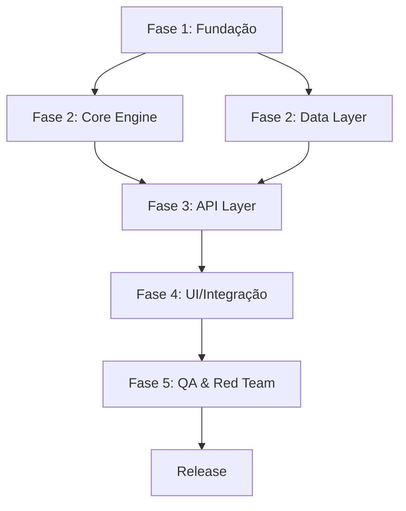

# 📐 DEEP PLANNING PROTOCOL — 5-Document Pre-Flight Gate

> 🔴 **LEI ABSOLUTA:** É expressamente PROIBIDO escrever qualquer linha de código, criar qualquer arquivo de implementação ou instanciar qualquer subagente de engenharia sem que os 5 documentos abaixo estejam 100% completos e aprovados pelo usuário. Zero exceções. Zero shortcuts. O planejamento é a fundação; código sem planejamento é ruído.

---

## GATILHO DE ATIVAÇÃO

Esta skill é ativada OBRIGATORIAMENTE quando:
- Qualquer projeto novo com 3+ arquivos de implementação
- Qualquer refatoração arquitetural significativa
- Qualquer novo sistema, motor ou plataforma
- `/grill-me` foi concluído e as respostas foram coletadas
- Usuário diz "vamos começar", "implementar" ou equivalente após discussão de design

---

## OS 5 DOCUMENTOS OBRIGATÓRIOS

Todos os 5 documentos são criados em sequência pelo agente. O usuário aprova ao final.

---

### 📄 DOCUMENTO 1 — ARCHITECTURE.md

**Propósito:** Estrutura técnica completa e irrevogável do sistema.

**Campos obrigatórios:**
```markdown
# ARCHITECTURE — [Nome do Projeto]
> Criado em: [timestamp] | Aprovado por: [usuário] em [data]

## Stack Tecnológica
- Linguagem(s): [com versões exatas]
- Framework(s): [com versões exatas]
- Banco de dados: [tecnologia + versão]
- Infraestrutura: [onde será executado]

## Diagrama de Componentes
[Diagrama Mermaid ou ASCII art mostrando todos os módulos e suas conexões]

## Fluxo de Dados Principal
[Sequência de chamadas, eventos e transformações de dados end-to-end]

## Padrões Arquiteturais Adotados
[Ex: Event-Driven, CQRS, Clean Architecture — com justificativa]

## Decisões Irrevogáveis (DEC::LOCKED)
[Decisões que NÃO podem ser revertidas sem refatoração total]

## Pontos de Extensão Futuros
[Onde o sistema foi projetado para crescer sem reescritas]
```

---

### 📄 DOCUMENTO 2 — RESEARCH.md

**Propósito:** Estado da arte, benchmarks globais e análise de alternativas.

**Campos obrigatórios:**
```markdown
# RESEARCH — [Nome do Projeto]

## Estado da Arte (SOTA)
[As melhores soluções existentes no mundo para este problema]

## Referências Técnicas Consultadas
[Papers, docs, repositórios, artigos com links]

## Bibliotecas Avaliadas
| Biblioteca | Prós | Contras | Decisão |
|---|---|---|---|
| lib-A | ... | ... | ADOTADA |
| lib-B | ... | ... | REJEITADA |

## Trade-offs Fundamentais
[As 3-5 tensões de design mais importantes e como foram resolvidas]

## Benchmark de Performance Esperada
[Métricas baseline: latência, throughput, uso de memória esperado]

## Anti-Padrões Identificados
[O que NÃO fazer neste domínio e por quê]
```

---

### 📄 DOCUMENTO 3 — CONTRACTS.md

**Propósito:** Contratos formais de interface entre módulos — o "handshake" entre componentes.

**Campos obrigatórios:**
```markdown
# CONTRACTS — [Nome do Projeto]

## Contratos de Interface por Módulo

### [Módulo A] → [Módulo B]
- **Input:** [tipo exato, formato, schema]
- **Output:** [tipo exato, formato, schema]
- **Pré-condição:** [o que deve ser verdade antes da chamada]
- **Pós-condição:** [o que é garantido após a chamada]
- **Invariante:** [o que nunca muda durante a execução]
- **Side-effects:** [efeitos colaterais esperados — I/O, estado global, etc.]
- **Erros possíveis:** [lista de falhas e como são sinalizadas]

## Contratos de Dados

### [Entidade / Schema]
```typescript
// Definição formal do tipo
interface [Nome] {
  field: type; // invariante: [restrição]
}
```

## Contratos de Comportamento Assíncrono
[Garantias de ordering, idempotência, retry e at-least-once vs exactly-once]
```

---

### 📄 DOCUMENTO 4 — RISKS.md

**Propósito:** Mapeamento completo de riscos técnicos e de negócio com mitigações concretas.

**Campos obrigatórios:**
```markdown
# RISKS — [Nome do Projeto]

## Matriz de Riscos

| Risk ID | Descrição | Probabilidade | Impacto | Mitigação | Owner |
|---|---|---|---|---|---|
| R-001 | [descrição] | Alta/Média/Baixa | Crítico/Alto/Médio/Baixo | [ação concreta] | [setor] |

## Riscos Técnicos Críticos
[Detalhamento dos top-3 riscos com plano de contingência passo-a-passo]

## Riscos de Arquitetura
[Decisões que podem se tornar gargalos ou pontos únicos de falha]

## Plano de Rollback
[Se tudo der errado na fase X, como reverter para estado estável]

## Suposições Perigosas (DEC::SPECULATIVE)
[O que estamos assumindo sem evidência — e como vamos validar]
```

---

### 📄 DOCUMENTO 5 — TIMELINE.md

**Propósito:** DAG de tarefas com dependências, estimativas e gates de qualidade.

**Campos obrigatórios:**
```markdown
# TIMELINE — [Nome do Projeto]

## DAG de Execução



## Milestones com Gates de Qualidade

| Milestone | Deliverables | Gate | Q-Score Mínimo |
|---|---|---|---|
| M1: Fundação | ARCHITECTURE.md aprovado, scaffolding criado | Revisão manual | — |
| M2: Core | Engine funcionando com dados reais | Gate 1: exit code 0 | 7.0 |
| M3: Integração | API + UI conectados | Gate 2: screenshot HD | 8.0 |
| M4: Release | Red Team 0 falhas críticas | Gate 3: Tribunal | 9.0 |

## Dependências Externas
[APIs de terceiros, datasets, credenciais — o que precisa estar disponível antes]

## Critério de "DONE" do Projeto
[Definição formal e mensurável de quando o projeto está completo]
```

---

## PROTOCOLO DE EXECUÇÃO

### Passo 1: Gerar os 5 Documentos
O agente executa em sequência, criando cada documento em disco dentro do projeto:
```
[raiz-do-projeto]/
  .planning/
    ARCHITECTURE.md
    RESEARCH.md
    CONTRACTS.md
    RISKS.md
    TIMELINE.md
```

### Passo 2: Apresentar ao Usuário
Após criar todos os 5, o agente apresenta um resumo e **PARA COMPLETAMENTE**.

```
✅ PLANEJAMENTO COMPLETO — 5/5 documentos gerados

📄 ARCHITECTURE.md — [N] componentes mapeados, stack definida
📄 RESEARCH.md — [N] alternativas avaliadas, [N] bibliotecas analisadas
📄 CONTRACTS.md — [N] contratos de interface formalizados
📄 RISKS.md — [N] riscos identificados, top-3 com mitigação
📄 TIMELINE.md — [N] milestones, [N] gates de qualidade

⛔ EXECUÇÃO BLOQUEADA até aprovação explícita.
Revise os documentos e confirme: "aprovado" ou solicite ajustes.
```

### Passo 3: Aguardar Aprovação Explícita
O agente não escreve uma única linha de código de implementação até receber confirmação.

### Passo 4: Instanciar o PROJECT_BRAIN.md
Após aprovação, antes de qualquer código, instanciar o mapa neural do projeto (`project-neural-map`).

---

## GATE DE QUALIDADE DOS DOCUMENTOS

Antes de apresentar ao usuário, o agente auto-audita cada documento:

- [ ] ARCHITECTURE.md: possui diagrama de componentes + decisões irrevogáveis documentadas
- [ ] RESEARCH.md: pelo menos 3 alternativas avaliadas + trade-offs documentados  
- [ ] CONTRACTS.md: todas as interfaces entre módulos têm pré/pós-condições formais
- [ ] RISKS.md: top-3 riscos com plano de contingência passo-a-passo
- [ ] TIMELINE.md: DAG em Mermaid + gates de qualidade com Q-Score mínimo por milestone

Se qualquer item falhar no checklist, o agente completa antes de apresentar.
