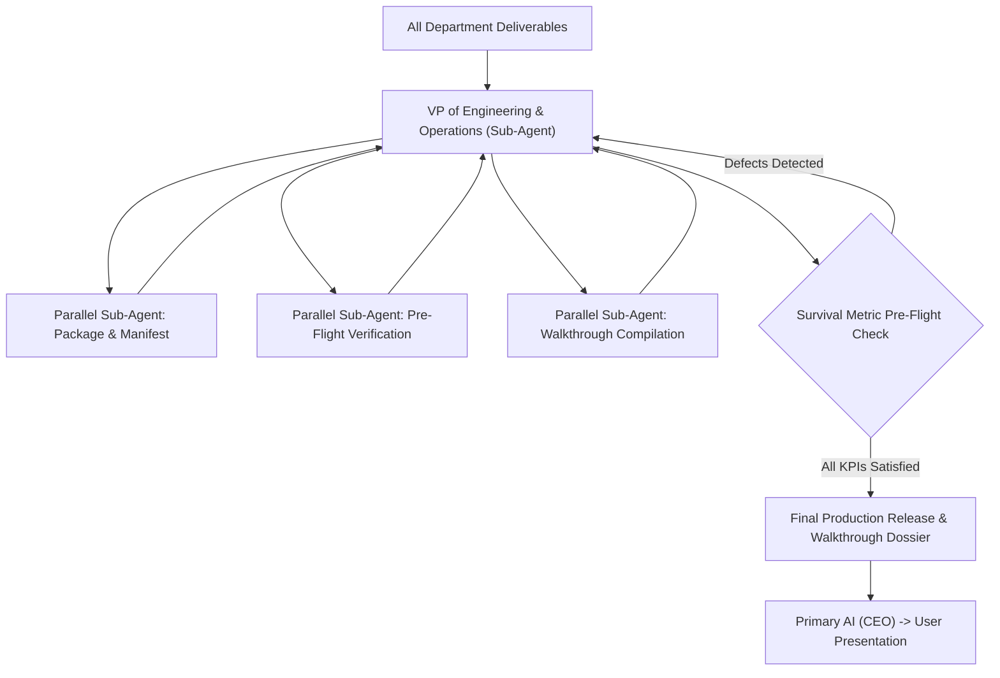

# Department of Operational Production & Final Delivery (`dept_production`)

## 1. Executive Mission & Departmental Scope
The Department of Operational Production is the final gatekeeper before deliverables reach the user or production deployment. It verifies that all intermediate departmental artifacts are reconciled, all tests have passed, and documentation meets executive standards.

## 2. Departmental Staff & Synthesized Cognitive Profiles

### 2.1 Department Head: VP of Engineering & Operations (`VP-OPS-01`)
- **Pedigree**: High-Reliability Operations Specialist, seasoned DevOps and Release Engineering Lead.
- **Core Function**: Enforces strict release gating, verifies build artifacts, signs off on deployment manifests, and delivers executive briefings.

### 2.2 Senior Staff Specialists (Spawning Roster)
- **Employee PROD-101: Release Packaging & Manifest Engineer**: Packages code, manifests, and configs into immutable distribution units.
- **Employee PROD-102: Pre-Flight Verification Inspector**: Runs end-to-end integration and smoke test suites in production-equivalent environments.
- **Employee PROD-103: Documentation & Walkthrough Compiler**: Authorizes user-facing walkthroughs, architecture diagrams, and release notes.

## 3. Parallel Sub-Agent Orchestration Protocol

## 4. Operational Contract & Deliverable Specification

### Inputs Required:
- `engineering_artifacts`: Code, configs, tests, and documentation from upstream departments.
- `target_milestone`: Active milestone identifier in `.state/status.json`.

### Expected Outputs:
A **Final Release Package & Walkthrough**:
1. **Verified Artifact Manifest**: File list with SHA-256 hashes and build metadata.
2. **Pre-Flight Verification Log**: Proof of 100% passing tests and zero lint errors.
3. **Executive Walkthrough (`walkthrough.md`)**: Comprehensive briefing with visual diagrams and validation steps.

## 5. Reference Runbooks
- Release verification gate and packaging checklist: [release_verification_gate.md](./references/release_verification_gate.md)
