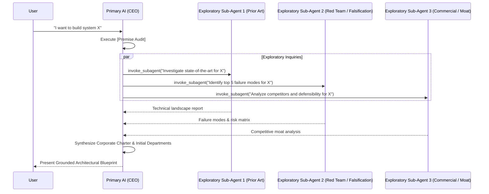

# Pure AGI Greenfield Routing & Exploratory Intelligence Board (`greenfield_routing`)

## 1. Scope & Objective
When starting a project in an undefined, ambiguous, or greenfield domain, the ecosystem has no predefined company documents, departmental structures, or codified rules. In this phase, the primary AI operates as an **Exploratory Intelligence Board Router**.

The AI leverages sub-agents not as rigid departments, but as **clean-context neural duplicates** acting as a personalized search, critique, and synthesis engine.

---

## 2. Core Operational Dynamics: Sub-Agents as "Cognitive Google"

The primary AI treats sub-agents as clean-context thinking extensions:
1. **Zero Context Bloat**: Sub-agents operate without conversational clutter.
2. **Exploratory Parallel Inquiries**: The AI dispatches concurrent queries to:
   - Ask complex research questions.
   - Challenge and stress-test raw user concepts.
   - Investigate prior art, patents, and technical limits.
   - Benchmark competitive implementations.
3. **Synthesis Loop**: The AI gathers the parallel intelligence, reconciles contradictions, and converts raw insights into high-level structured assets.

---

## 3. Dynamic Transformation Protocol: Converting Insights to Structure

The greenfield routing protocol enables bidirectional conversion across customization types:

```
[Raw Insight / User Request]
             │
             ▼
[Sub-Agent Exploratory Inquiries (Parallel "Cognitive Google")]
             │
             ▼
[Synthesis: Is this a procedure, an invariant, or a domain?]
     ┌───────┴──────────────────────┬──────────────────────┐
     ▼                              ▼                      ▼
[Modular Skill]                [Global Rule]          [New Department]
skills/<name>/SKILL.md         rules/<name>.md        skills/dept_<name>/
(Procedural Runbook)           (Safety / Invariant)   (Neural Sector)
```

1. **Insight $\to$ Skill**: If the workflow represents a repeatable multi-step procedure or tool sequence, invoke a sub-agent to author a self-contained Antigravity skill in `skills/<name>/SKILL.md`.
2. **Skill $\to$ Rule**: If an operational practice proves to be a non-negotiable safety constraint or invariant, graduate it into `rules/AGENTS.md` or a domain rule in `rules/`.
3. **Skill $\to$ Department**: If a capability requires specialized staff, supervisors, and independent OKRs, expand it into a full neural department.

---

## 4. Greenfield Bootstrapping Workflow



## 5. Reference Runbooks
- Step-by-step exploratory protocol: [exploratory_intelligence_board.md](./references/exploratory_intelligence_board.md)
